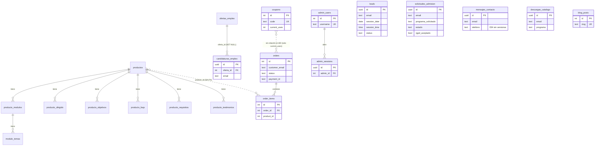

# Auditoría de formularios y flujo de datos — web IDESIE

- **Fecha:** 2026-09-25
- **Modo:** solo lectura. No se ha modificado ningún archivo del proyecto salvo este informe. No se ha ejecutado ninguna consulta ni migración contra la base de datos.
- **Fuente de verdad:** el código del repositorio. `CLAUDE.md` se ha usado como pista, **no como prueba** (contiene secciones desactualizadas; ver §8).
- **Convención:** ⚠️ **POR VERIFICAR** = no se puede confirmar leyendo el código (estado real de la base de datos, del dashboard de Resend/Vercel/Calendly, etc.).
- **Secretos:** solo se citan nombres de variables, nunca valores.

---

## 1. Resumen del stack

| Capa | Detalle |
|---|---|
| Framework | Next.js 16.2.0 (App Router, Turbopack), React 19, TypeScript |
| Estilos / UI | Tailwind CSS v4, shadcn/ui (Radix), GSAP + Lenis (animación / scroll) |
| Base de datos | **PostgreSQL en Supabase** (proyecto único hoy). Acceso solo mediante `@supabase/supabase-js` con la clave `service_role` desde servidor (`lib/supabase/server.ts`). **No hay ORM** (ni Prisma ni Drizzle): consultas PostgREST directas |
| Cliente Supabase de navegador | `lib/supabase/browser.ts` (clave anon) existe pero **no lo usa nada** |
| Validación | `zod` 3.25 (`lib/api-validation.ts`) en los endpoints públicos; validación manual en Server Actions y en la baja de datos |
| Email transaccional | Resend (`lib/resend.ts`), remitente de pruebas `onboarding@resend.dev` (TODO en cada fichero) |
| Pagos | Flywire *Pay-by-Link* (URL construida en servidor, sin SDK ni webhook) |
| Analítica / tracking | `@vercel/analytics` (`app/layout.tsx`), Meta Pixel (solo `/landing`, `NEXT_PUBLIC_META_PIXEL_ID`) |
| Reservas | **Calendly** (embed `<iframe>` en `/landing` y `/contact-page`) — ver §4 |
| Hosting | Vercel (deducible por `@vercel/analytics`, comentarios del código y commits "pick up env vars from Vercel"). ⚠️ POR VERIFICAR: configuración real del proyecto |
| Auth | Solo panel `/admin` (contraseña compartida "clave secreta" + sesión propia en `admin_sessions`). **No hay registro ni login de usuarios finales** |
| Modo mock | `lib/mock-mode.ts`: en desarrollo, sin `SUPABASE_SERVICE_ROLE_KEY`/`RESEND_API_KEY`, los servicios se simulan. En producción nunca |
| Trabajos programados (cron) / webhooks entrantes en el repo | **Ninguno** en código de la web. Sí existen (sin aplicar, ver §7.0) un cron `pg_cron` y un webhook saliente en `crm-integration/` |

**Variables de entorno usadas (solo nombres):** `NEXT_PUBLIC_SUPABASE_URL`, `NEXT_PUBLIC_SUPABASE_ANON_KEY`, `SUPABASE_SERVICE_ROLE_KEY`, `RESEND_API_KEY`, `NEXT_PUBLIC_BASE_URL`, `NEXT_PUBLIC_META_PIXEL_ID`. (`NODE_ENV` para el modo mock.) `.env.local` está en `.gitignore` y `git ls-files` confirma que no hay ningún `.env*` versionado.

---

## 2. Inventario de formularios y puntos de captura

| # | Formulario | Dónde aparece | Componente | Destino de los datos |
|---|---|---|---|---|
| F1 | **Solicitud de admisión** | `/landing`, `/mbim-page`, `/mbbe-page`, `/embim-page`, `/mbim-online-page` | `components/admision-modal.tsx` (usado desde `admision-section.tsx`, `mbim-online/closing-section.tsx`, `landing-client.tsx`) | `POST /api/admision` → tabla `solicitudes_admision` + 2 emails |
| F2 | **Descarga de catálogo** | `/landing`, páginas de máster (vía `ClosingCta`, `CatalogDownloadButton`), `/in-company-page` (`ClosingCta`) | `components/catalog-download-dialog.tsx` | `POST /api/send-catalog` → tabla `descargas_catalogo` + email con PDF adjunto |
| F3 | **Contacto ("Escribir mensaje")** | `/contact-page` (pestaña 1) | `app/contact-page/contact-client-page.tsx` | `POST /api/contact` → tabla `mensajes_contacto` + 2 emails |
| F4 | **Candidatura de empleo** | `/bolsa-de-empleo-page` (oferta concreta y candidatura espontánea) | `components/job-application-modal.tsx` (desde `empleo/oferta-card.tsx`, `empleo/tablon-cv-cta.tsx`) | `POST /api/empleo/candidatura` → tabla `candidaturas_empleo` + 2 emails |
| F5 | **Solicitud de baja de datos** | `/solicitud-baja-page` | `app/solicitud-baja-page/solicitud-baja-client.tsx` | Server Action `submitDeletionRequest` → **solo emails, no se guarda nada** |
| F6 | **Checkout: datos del comprador + cupón** | `/checkout` | `components/checkout/pedido-buyer-form.tsx`, `pedido-coupon.tsx`, `app/checkout/page.tsx` | Server Actions `calculateVerifiedTotal` / `createOrderAndGetPaymentUrl` → `orders`, `order_items`, `coupons` → redirección a Flywire |
| F7 | **Pago directo** | `/pago-directo` | `components/direct-payment-form.tsx` | Mismas Server Actions que F6 (producto fijo `id 8`) |
| F8 | **Login de administrador** | `/admin/login` | `app/admin/login/page.tsx` | `POST /api/admin/auth` → `admin_users`, `admin_sessions` |
| F9 | **Formularios internos del panel** (crear/editar) | `/admin/posts/*`, `/blog/edit/[slug]`, `/admin/tienda/*`, `/admin/empleo/*`, `/admin/admisiones` | `blog-post-form.tsx`, `producto-form.tsx`, `tienda/modulos-editor.tsx`, `tienda/lista-editor.tsx`, `empleo/oferta-form.tsx`, `admision/solicitudes-table.tsx` | Server Actions → `blog_posts`, `productos`, `producto_*`, `modulo_temas`, `ofertas_empleo`, `solicitudes_admision.estado` |
| F10 | **Calendly (embed de terceros)** | `/landing` (`#agenda`), `/contact-page` (pestaña "Agendar") | `<iframe>` directo | **Los datos van a Calendly, no a nuestra base de datos** — ver §4 |

**No existen:** newsletter, registro de usuarios, formulario de presupuesto propio, popups de captación, comentarios. (`grep` de `newsletter|subscribe|suscri` no aparece en flujos reales.)

### Código relacionado con formularios que NO está conectado a nada

| Elemento | Estado |
|---|---|
| `app/api/leads/route.ts`, `app/api/leads/disponibilidad/route.ts`, `lib/leads-db.ts`, `lib/leads-time-slots.ts`, tabla `leads` (+ índice único `leads_slot_unico`) | **Sin ningún consumidor en el frontend.** Los usaba el antiguo `InfoRequestModal`/`TimeSlotPicker` de `/landing` (calendario de disponibilidad propio, commits `ee40b9b`/`a7a47e0`), sustituido después por el embed de Calendly. Siguen desplegados y **cualquiera puede llamar a `POST /api/leads`** |
| `emails/*.tsx` (`lead-confirmation`, `admision-confirmation`, `admision-internal-notice`, `_components`) | Plantillas React Email **no importadas por ningún archivo de `app/`, `components/` ni `lib/`** (comprobado por `grep`). Los emails reales usan HTML en línea en cada `lib/*-db.ts` |
| `app/admision/actions.tsx` (`submitAdmissionForm`) | Código muerto: Server Action de admisión antigua (solo email, sin BD), sin ninguna importación |
| `lib/supabase/browser.ts` | Sin uso |

---

## 3. Ficha detallada de cada formulario

> Notas comunes a F1–F4: todos siguen el patrón **validar (zod) → insertar en Supabase con `service_role` → enviar emails con Resend en modo *best-effort*** (un fallo de email se registra pero no revierte el insert). Todos los emails salen de `IDESIE <onboarding@resend.dev>` (⚠️ dominio de pruebas de Resend). Las plantillas escapan el HTML de usuario con `lib/escape-html.ts`.
> Ninguno tiene captcha, honeypot ni rate limiting (ver §8).

### F1 — Solicitud de admisión

- **Flujo:** `AdmisionModal` (estado local + validación manual) → `fetch POST /api/admision` → `parseJsonBody(admisionSchema)` → `createSolicitudAdmision()` (`lib/admision-db.ts`) → `insert` en `solicitudes_admision` → 2 emails.
- **Campos:**

| Campo (form → API → columna) | Obligatorio | Validación cliente | Validación servidor |
|---|---|---|---|
| `nombreCompleto` → `nombre_completo` | Sí | no vacío | `min(1)` |
| `email` → `email` | Sí | regex `^[^\s@]+@[^\s@]+\.[^\s@]+$` | `.email()`; se guarda en minúsculas |
| `telefono` → `telefono` | Sí | regex `^[+\d][\d\s]{7,}$` | **solo `min(1)`** (más laxa que el cliente) |
| `pais` → `pais` | No | — | string |
| `ciudad` → `ciudad` | No | — | string |
| `fechaNacimiento` → `fecha_nacimiento` (`date`) | No | — | string libre (**no se valida formato**; un valor inválido haría fallar el insert con error 500) |
| `titulacionPrevia` → `titulacion_previa` | No | — | string |
| `universidadOrigen` → `universidad_origen` | No | — | string |
| `programaSolicitado` → `programa_solicitado` | Sí | Select | enum `MBIM|MBBE|EMBIM|Online` (+ `CHECK` en BD) |
| `origen` → `origen` (lo fija el código de la página, no el usuario) | Sí | — | enum `landing|mbim|mbbe|embim|online` (+ `CHECK` en BD) |
| `mensaje` → `mensaje` | No | — | string |
| `rgpdAceptado` → `rgpd_aceptado` | Sí | checkbox | debe ser `true` |
| — → `cv_url` | — | **Ya no se pide** (siempre `null`) | — |
| — → `estado` (`pendiente`), `created_at`, `updated_at` | por defecto en BD | | |

- **Efectos secundarios:** email al equipo (`info@idesie.com`, `replyTo` = solicitante) y confirmación al solicitante; evento **Meta Pixel `Lead`** en el cliente al recibir `200` (no-op si no hay `fbq`, es decir, fuera de `/landing`).
- **Errores:** el servidor devuelve `400 {error}` (validación) o `500 {error:"Error al enviar la solicitud…"}`; el modal muestra el mensaje y permite reintentar.
- **Antispam:** ninguno.
- **Lectura posterior:** `/admin/admisiones` (Server Action `getAdminSolicitudes`) y `updateEstadoSolicitud` (cambia `estado`, protegido con clave secreta).

### F2 — Descarga de catálogo

- **Flujo:** `CatalogDownloadDialog` → `fetch POST /api/send-catalog` → zod → lee el PDF de `public/catalogs/` → `createDescargaCatalogo()` (`lib/catalogo-db.ts`) → `insert` en `descargas_catalogo` → email con PDF adjunto.
- **Campos:**

| Campo → columna | Obl. | Cliente | Servidor |
|---|---|---|---|
| `name` → `nombre` | Sí | `required` HTML | `min(1)` |
| `email` → `email` | Sí | `type=email required` | `.email()` |
| `telefono` → `telefono` | Sí | HTML | regex `^[+\d][\d\s]{7,}$` |
| `catalogId` → `catalogo_id` (prop del componente) | Sí | — | debe existir en `catalogMapping`, si no `404` |
| `catalogName` → `catalogo_nombre` | No | — | string |
| derivado de `catalogId` → `programa` | Sí | — | `programaMapping` → `MBIM|MBBE|EMBIM|Online` (+ `CHECK`) |
| `rgpdAceptado` → `rgpd_aceptado` | Sí | checkbox + bloqueo | `true` obligatorio |

- **Efectos secundarios:** email a **quien pide el catálogo** con el PDF adjunto (sin aviso interno al equipo). Meta Pixel `Lead` vía `onSuccess` (solo en `/landing`).
- **Errores:** si el PDF no existe → `500`; si falla el insert → `500` (se propaga); si falla Resend → **solo log** (el usuario ve "¡Catálogo enviado exitosamente!" aunque no haya recibido nada — ⚠️ ver §8).
- **Catálogos:** `catalogoMBIM.pdf`, `catalogo_mbbe_2025.pdf` reales; `catalogo_master_bim_online.pdf` y `catalogo_executive_master_bim.pdf` — según `CLAUDE.md` son *placeholders* de ~600 B. ⚠️ POR VERIFICAR el contenido real de esos dos archivos.
- **Antispam:** ninguno. Endpoint público que **envía un adjunto de ~8–18 MB a cualquier email** que se le indique → vector de abuso (ver §8).

### F3 — Contacto ("Escribir mensaje")

- **Flujo:** `ContactClientPage.handleSubmit` → `fetch POST /api/contact` → zod → `createMensajeContacto()` (`lib/contact-db.ts`) → `insert` en `mensajes_contacto` → 2 emails.
- **Campos:**

| Campo → columna | Obl. | Servidor |
|---|---|---|
| `name` → `nombre` | Sí | `min(1)` |
| `email` → `email` | Sí | `.email()`, se guarda en minúsculas |
| `phone` → `telefono` | No | regex si viene informado (cadena vacía → `undefined`) |
| `subject` (estado) → `asunto` | No | string |
| `message` → `mensaje` | Sí | `min(1)` |
| `?motivo=` (query) → `motivo` | No | string libre (**sin enum**) |
| `?programa=` (query) → `programa` | No | string libre (**sin enum**) |

- **Sin casilla RGPD / sin enlace a la política de privacidad** en este formulario (no hay `rgpd_aceptado` en la tabla).
- **Cambios sin commitear:** el campo `telefono` (columna, esquema zod, input y email) está en el working tree (`git status`: `app/api/contact/route.ts`, `lib/contact-db.ts`, `contact-client-page.tsx` modificados; `scripts/034_…sql` sin versionar). ⚠️ POR VERIFICAR si `034` está aplicada en Supabase: si el código se despliega sin la columna, **todos los envíos de contacto fallarán con 500**.
- **Efectos:** aviso a `info@idesie.com` + confirmación al remitente. **Sin evento de Meta Pixel.**
- **Errores:** `400` de zod o `500`; el formulario muestra el mensaje en un banner.

### F4 — Candidatura de empleo

- **Flujo:** `JobApplicationModal` → `POST /api/empleo/candidatura` → `createCandidatura()` (`lib/candidaturas-db.ts`) → `insert` en `candidaturas_empleo` → 2 emails.
- **Campos:** `ofertaId` (int, nullable) → `oferta_id` (FK a `ofertas_empleo`), `ofertaPuesto` → `oferta_puesto`, `nombre` (obl.), `email` (obl., `.email()`), `telefono` (obl., solo `min(1)`), `mensaje` (opc.), `cvUrl` → `cv_url` (**siempre `null`**: la subida de CV se eliminó; el campo sigue aceptándose por API).
- **Cliente:** `required` HTML en nombre/email/teléfono. **Sin casilla RGPD** (no hay columna).
- **Validación servidor que falta:** `ofertaId` no se comprueba contra `ofertas_empleo` (un id inexistente violaría la FK → 500); el email no se pasa a minúsculas (a diferencia de F1/F3).
- **Efectos:** aviso al equipo (`replyTo` = candidato) y confirmación al candidato. Sin Meta Pixel.

### F5 — Solicitud de baja de datos (derecho de supresión)

- **Flujo:** formulario → Server Action `submitDeletionRequest(formData)` (`app/solicitud-baja-page/actions.tsx`) → **2 emails y nada más**.
- **Campos:** `nombre` (obl.), `email` (obl., regex simple), `motivo` (obl., `<select>` nativo), `comentarios` (opc.). Sin RGPD checkbox.
- **🔴 No se guarda en ninguna tabla**: no hay registro/auditoría de que se recibió ni de que se ejecutó la supresión (obligación de trazabilidad RGPD). Si el email falla, la solicitud se pierde.
- **🔴 Los emails interpolan `nombre`, `email`, `motivo` y `comentarios` SIN escapar HTML** (a diferencia de F1–F4): inyección de HTML en el buzón de `info@idesie.com` y en el email de confirmación.
- **Efecto para el CRM/BD:** la supresión de datos **no borra nada automáticamente**; es un proceso manual sobre ≥6 tablas con datos personales (§6).
- `console.error("[v0] …")` conserva prefijo de depuración.

### F6 — Checkout (`/checkout`)

- **Flujo:** carrito en `localStorage` (`contexts/cart-context.tsx`) → `calculateVerifiedTotal(items, cupón)` (recalcula precios desde `productos`, valida cupón contra `coupons`) → `createOrderAndGetPaymentUrl({cartItems, couponCode, buyer})` → `insert` en `orders` y `order_items`, `update coupons.current_uses` → devuelve URL de Flywire con `amount` y `student_*` → el navegador abre Flywire.
- **Campos del comprador:** `firstName`, `lastName`, `email` (solo formato). **No se recoge teléfono, dirección, ni consentimiento RGPD/condiciones.**
- **Columnas escritas:** `orders.customer_email`, `customer_name` (= nombre + apellidos concatenados), `status='pending'`, `total_amount`; `order_items.order_id, product_id, product_name, quantity, price`.
- **Precio:** siempre recalculado en servidor (bien). El id negativo (`-id`) identifica la línea de "matrícula".
- **🔴 Ciclo de vida del pedido incompleto:** no hay webhook/callback de Flywire → **el pedido queda `pending` para siempre**; `orders.payment_id` nunca se rellena; no hay página de retorno/confirmación. No se puede saber qué pedidos se pagaron.
- **Race condition menor:** `coupons.current_uses` se incrementa con read-modify-write (no atómico) y **se consume al crear el pedido, no al pagar**.
- **Sin email al comprador ni al equipo** al crear el pedido.

### F7 — Pago directo (`/pago-directo`)

- Mismo backend que F6, con un único producto fijo (`id 8`, `master-bim-full-time`). Campos: `firstName`, `lastName`, `email`, `promoCode`. Mismas carencias que F6 (sin teléfono, sin RGPD, pedido `pending` indefinido).

### F8 — Login de administrador

- `POST /api/admin/auth` con `{secretKey}`; comprobación de origen (`lib/verify-origin.ts`); `verifyAdminSecret` compara con bcrypt contra **todas** las filas de `admin_users` (login sin usuario; contraseña compartida). Crea fila en `admin_sessions` (con `user_agent` e `ip_address` = cabecera `x-forwarded-for` completa) y cookie `admin-auth` `httpOnly`, `sameSite=strict`, 24 h.
- **Sin rate limiting ni bloqueo por intentos.** `middleware.ts` protege `/admin/:path*` (excepto `/admin/login`).

### F9 — Formularios internos (panel)

- **Blog** (`createBlogPost/updateBlogPost/deleteBlogPost`): `title, slug, content, excerpt, author, featuredImageUrl, tags` → `blog_posts`. Cada acción exige `secretKey`.
- **Tienda** (`app/tienda/actions.ts`, `modulos-actions.ts`, `detalle-actions.ts`): `productos` y las 7 tablas de detalle.
- **Empleo** (`app/empleo/actions.ts`): `ofertas_empleo` (`puesto, empresa, ubicacion, salario, tipoContrato, descripcion, enlaceExterno, destacada, activa`).
- **Admisiones:** solo `updateEstadoSolicitud` (cambia `estado`).
- Todas son Server Actions que verifican `secretKey` (pedida en cada envío) con `verifyAdminSecret`.
- ⚠️ **`app/blog/edit/[slug]/page.tsx`** es una **página cliente fuera de `/admin/*`** (no la cubre `middleware.ts`) que duplica `admin/posts/edit/[slug]`. Muestra el formulario de edición a cualquiera; el guardado sí exige `secretKey`, pero la carga del post y la UI quedan expuestas. Probable código heredado.
- ⚠️ **POR VERIFICAR:** `getAdminSolicitudes`, `getAdminCandidaturas`, `getAdminOfertas` están en archivos `"use server"` y **no comprueban autenticación en su cuerpo** (solo las protege que la página `/admin/*` que las llama esté tras el middleware). Devuelven datos personales completos. Hoy solo las importan Server Components (no aparecen en bundles de cliente), pero cualquier futuro import desde un Client Component las expondría como endpoints públicos. Recomendación: comprobar la sesión dentro de cada acción.

---

## 4. Integración con Calendly (sección prioritaria)

### 4.1 Dónde aparece

| Ubicación | Archivo | Qué hace |
|---|---|---|
| **`/landing` — sección `#agenda`** | `app/landing/landing-client.tsx` (~líneas 3177–3210 y 4088–4110) | `<iframe src="https://calendly.com/idesie-info/30min?embed_domain=<host>&embed_type=Inline">`. El `src` se construye en cliente (`useState/useEffect`) para pasar `embed_domain` = `window.location.host` |
| **`/landing` — escucha de eventos** | mismo archivo (~3193–3210) | `window.addEventListener("message")`: si `origin === "https://calendly.com"` y `event === "calendly.event_scheduled"` → dispara `trackMetaPixelEvent("Schedule")` y `("Lead")` (una sola vez por carga, `scheduleFiredRef`) |
| **`/landing` — CTAs** | mismo archivo | **9 botones "Agendar mi llamada gratuita" / "Agendar llamada"** con `href="#agenda"` (hero, nav, sección programa, IA, certificación, admisión, CTA final, barra fija). La **barra flotante** (`.landing-sticky-cta`) se oculta cuando `#agenda` está visible |
| **`/contact-page` — pestaña "Agendar"** | `app/contact-page/contact-client-page.tsx` (~57–60, 137, 259–261) | `<iframe src="https://calendly.com/idesie-info/30min">` (sin `embed_domain`, no escucha eventos). La pestaña se abre por defecto si la URL trae `?motivo=` |
| **Enlaces de entrada a esa pestaña** | `app/mbim-page/page.tsx`, `app/mbbe-page/page.tsx`, `app/embim-page/page.tsx`, `app/producto/[slug]/page.tsx`, `app/landing/landing-client.tsx`, `components/mbim-online/closing-section.tsx`, `components/producto/ficha-sidebar.tsx`, `components/programa/experience-band.tsx`, `app/contact-page/page.tsx` | Enlaces `/contact-page?motivo=asesoria|clase&programa=…` (≈10 usos). No mencionan Calendly, pero **el destino real es el embed de Calendly** |
| Comentarios / doc | `components/meta-pixel.tsx` (comentario que cita "reserva de Calendly"), `CLAUDE.md` | Solo texto |

**No hay:** SDK ni `<script>` de Calendly (`assets.calendly.com/widget.js`), llamadas a la API de Calendly, webhooks entrantes de Calendly, ni variables de entorno `CALENDLY_*` (verificado por `grep` insensible a mayúsculas en todo el repo, sin `node_modules`/`.next`).

### 4.2 Qué datos llegan desde Calendly y si se guardan

- **Ningún dato personal llega a nuestro servidor.** La reserva (nombre, email, teléfono, hueco, respuestas) vive **solo en la cuenta de Calendly** (`idesie-info`, evento `30min`). ⚠️ POR VERIFICAR en el panel de Calendly: qué preguntas personalizadas se piden, qué integraciones/notificaciones tiene, y si hay webhooks configurados de su lado hacia otro servicio.
- Lo único que recibe el frontend es el `postMessage` `calendly.event_scheduled`, que **solo se usa para disparar eventos de Meta Pixel**; no se lee ni se envía al servidor el contenido del mensaje.
- **Consecuencia:** las citas de Calendly **no existen en nuestra base de datos** (ni en `leads` ni en ninguna otra tabla). No hay forma de cruzarlas con contactos, admisiones o pedidos sin exportarlas manualmente.

### 4.3 Qué depende de Calendly y se rompería/cambiaría al quitarlo

1. **Todo el canal "hablar con un asesor"**: hoy es el único canal de captación de citas de `/landing` (las 9 CTAs apuntan a `#agenda`).
2. **Conversión "Schedule/Lead" en Meta Ads**: se dispara solo desde el `postMessage` de Calendly. Sin él, las campañas de pago perderían su evento de conversión principal de `/landing` (quedarían solo los `Lead` de F1/F2).
3. **Pestaña "Agendar" de `/contact-page`** y los ≈10 enlaces `?motivo=` de las páginas de programa (abren esa pestaña por defecto).
4. **Barra flotante de CTA** de `/landing` (lógica de ocultación ligada a `#agenda`).
5. Emails de confirmación/recordatorio, calendarios Google/Outlook y gestión de cancelaciones/reprogramaciones: **los hace Calendly**; habría que reemplazarlos.
6. Política de privacidad/cookies: **no menciona a Calendly** como tercero que recibe datos (ver §6) — al quitarlo desaparece el problema, pero mientras exista debería constar.

### 4.4 Archivos a modificar o eliminar para quitar Calendly

| Acción | Archivo |
|---|---|
| Modificar | `app/landing/landing-client.tsx` — eliminar estado `calendlySrc`, el `useEffect` de `embed_domain`, el listener `message`/`scheduleFiredRef`, la sección `<section id="agenda">`, `.agenda-embed`/`.agenda-embed-loading` (CSS), refs `agendaRef` y la lógica de la barra flotante que la observa, y reapuntar las 9 CTAs |
| Modificar | `app/contact-page/contact-client-page.tsx` — quitar pestaña "schedule", el `<iframe>`, y el arranque en esa pestaña cuando hay `motivo` |
| Modificar | `app/contact-page/page.tsx` (Suspense/`motivo`), `app/mbim-page/page.tsx`, `app/mbbe-page/page.tsx`, `app/embim-page/page.tsx`, `app/producto/[slug]/page.tsx`, `components/mbim-online/closing-section.tsx`, `components/producto/ficha-sidebar.tsx`, `components/programa/experience-band.tsx` — reapuntar los enlaces `?motivo=` al nuevo sistema de reservas |
| Revisar | `components/meta-pixel.tsx` (comentario) y `CLAUDE.md` |
| Eliminar | Nada específico de Calendly (no hay SDK, endpoints ni env vars) |
| Decisión previa | Qué hacer con `/api/leads`, `/api/leads/disponibilidad`, `lib/leads-db.ts`, `lib/leads-time-slots.ts`, tabla `leads` y `emails/lead-confirmation.tsx`: **son el esqueleto de un sistema de reservas propio ya construido y abandonado** (ver §7.5) |

---

## 5. Esquema de la base de datos

### 5.1 Cómo se gestionan las migraciones hoy

- **A mano.** Scripts SQL numerados en `scripts/` que se pegan en Supabase → SQL Editor (los propios scripts lo indican). **No hay herramienta de migraciones** (sin `supabase/migrations`, Prisma, Drizzle, Flyway…), **no hay registro de qué scripts están aplicados** y no hay entorno de staging documentado.
- Convención observada: `create table if not exists`, RLS activado en todas las tablas, trigger genérico `public.set_updated_at()` (definido en `020`), datos personales **sin ninguna policy** (acceso solo `service_role`), contenido público con policy `SELECT`.
- ⚠️ **POR VERIFICAR:** qué scripts están aplicados realmente en el proyecto de producción (`020`–`033` según `CLAUDE.md`; `034` no versionado; `crm-integration/sql/*` sin evidencia de aplicación).
- **Scripts heredados de la época Neon** (`001`, `002`, `007`, `008`, `009`, `010`, `014`, `015`, `create-applications-table.sql`): duplican o contradicen el esquema vigente (`022`). `015`/`create-applications-table.sql` definen `applications`, ya eliminada por `031`. `008` inserta cupones reales (p. ej. `IDESTIE10`). Riesgo: re-ejecutar un script antiguo por error.

### 5.2 Tablas (columnas principales)

**Captación (datos personales)**

| Tabla | Columnas | Restricciones / índices |
|---|---|---|
| `leads` | `id uuid PK`, `first_name`, `last_name`, `phone`, `email`, `master_interes`, `session_date date`, `session_time time`, `origen` (def. `landing`), `status` (`nuevo\|contactado\|cualificado\|matriculado\|descartado`, def. `nuevo`), `notes`, `created_at`, `updated_at` | Índices: email, created_at, status, master_interes. **Índice único parcial `leads_slot_unico (session_date, session_time) WHERE status <> 'descartado'`** (1 sesión por franja). RLS sin policies |
| `solicitudes_admision` | `id uuid PK`, `nombre_completo`, `email`, `telefono`, `pais`, `ciudad`, `fecha_nacimiento date`, `titulacion_previa`, `universidad_origen`, `programa_solicitado` (CHECK 4 valores), `origen` (CHECK 5 valores), `cv_url`, `mensaje`, `estado` (`pendiente\|revisado\|aceptado\|rechazado`), `rgpd_aceptado bool`, `created_at`, `updated_at` | Índices: estado, programa, created_at. RLS sin policies |
| `mensajes_contacto` | `id uuid PK`, `nombre`, `email`, `asunto`, `mensaje`, `motivo`, `programa`, `created_at`; **`telefono`** (script `034`, sin versionar) | Índice created_at. RLS sin policies. Sin `updated_at` ni estado |
| `descargas_catalogo` | `id uuid PK`, `nombre`, `email`, `telefono`, `catalogo_id`, `catalogo_nombre`, `programa` (CHECK 4 valores), `rgpd_aceptado`, `created_at` | Índices: created_at, programa. RLS sin policies |
| `candidaturas_empleo` | `id uuid PK`, `oferta_id int FK→ofertas_empleo.id ON DELETE SET NULL`, `oferta_puesto`, `nombre`, `email`, `telefono`, `mensaje`, `cv_url`, `created_at` | Índices: oferta_id, created_at. RLS sin policies. Sin RGPD, sin estado |
| `orders` | `id serial PK`, `customer_email`, `customer_name`, `customer_phone`, `payment_id`, `status` (def. `pending`, **sin CHECK**), `total_amount numeric(10,2)`, `shipping_*` (5 cols sin usar), `created_at`, `updated_at` | Índices: payment_id, customer_email. RLS sin policies |
| `order_items` | `id serial PK`, `order_id FK→orders ON DELETE CASCADE`, `product_id int` (**sin FK a `productos`**), `product_name`, `quantity`, `price` | Índice order_id |
| `coupons` | `id serial PK`, `code UNIQUE`, `discount_type` (`percentage\|fixed`), `discount_value`, `is_active`, `valid_from`, `valid_until`, `max_uses`, `current_uses` | RLS sin policies |

**Contenido y administración**

| Tabla | Notas |
|---|---|
| `productos` | `id serial`, `slug UNIQUE`, `tipo`, `nombre`, descripciones, `precio_actual` (nullable), `precio_original`, `precio_matricula`, `duracion_*`, `modalidad`, `certificacion`, `categoria`, `destacado`, `imagen`, `activo`. Policy SELECT pública si `activo` |
| `producto_modulos`, `modulo_temas`, `producto_dirigido`, `producto_objetivos`, `producto_faqs`, `producto_requisitos`, `producto_testimonios` | Detalle de producto, FK a `productos` (o a `producto_modulos`) `ON DELETE CASCADE`, columna `orden`. Policy SELECT pública si el producto está activo |
| `ofertas_empleo` | `id serial`, `puesto`, `empresa`, `ubicacion`, `salario` (texto), `tipo_contrato`, `descripcion`, `enlace_externo`, `destacada`, `activa`. Policy SELECT pública si `activa` |
| `blog_posts` | `id serial`, `slug UNIQUE`, `title`, `excerpt`, `content`, `author`, `published`, `tags jsonb`, `featured_image_url`. Policy SELECT pública si `published` |
| `admin_users` | `id serial`, `username UNIQUE`, `password_hash` (bcrypt), `last_login` |
| `admin_sessions` | `id uuid`, `admin_id FK→admin_users ON DELETE CASCADE`, `expires_at`, `revoked_at`, `user_agent`, `ip_address` |
| ~~`applications`~~ | Eliminada (`031`). ⚠️ POR VERIFICAR que el `DROP` se ejecutó |

Extras en `crm-integration/` (**no aplicados en este repo, ver §7.0**): `crm_sync_log` (proyecto web) y `sources`, `contacts`, `submissions` (proyecto CRM).

### 5.3 Diagrama

**Observación clave:** `leads`, `solicitudes_admision`, `mensajes_contacto`, `descargas_catalogo`, `candidaturas_empleo` y `orders` **no comparten ninguna clave** (ni `contact_id`, ni `person_id`): la única forma de reconocer que son la misma persona es el texto del `email` (sin normalizar de forma homogénea, sin índice único, con mayúsculas/minúsculas variables — F4 y `orders` no lo pasan a minúsculas).

### 5.4 Quién escribe y quién lee cada tabla

| Tabla | Escribe | Lee |
|---|---|---|
| `leads` | `POST /api/leads` (`lib/leads-db.ts`) — **sin consumidor en UI** | `GET /api/leads/disponibilidad`. **Ninguna pantalla del admin** |
| `solicitudes_admision` | `POST /api/admision`; `updateEstadoSolicitud` (admin) | `/admin/admisiones`, `/admin/dashboard` |
| `mensajes_contacto` | `POST /api/contact` | **Nada en la web** (solo el email a `info@idesie.com`; no hay pantalla de admin) |
| `descargas_catalogo` | `POST /api/send-catalog` | **Nada en la web** |
| `candidaturas_empleo` | `POST /api/empleo/candidatura` | `/admin/empleo/candidaturas`, `/admin/dashboard` |
| `orders`, `order_items` | `createOrderAndGetPaymentUrl` | **Nada** (sin pantalla de admin) |
| `coupons` | Solo SQL manual (no hay CRUD) ; `createOrderAndGetPaymentUrl` incrementa `current_uses` | `validateCouponServer` |
| `productos` + 7 tablas de detalle | Server Actions de `/admin/tienda` | `/tienda`, `/producto/[slug]`, `/api/productos`, `sitemap.ts`, checkout |
| `ofertas_empleo` | Server Actions de `/admin/empleo` | `/bolsa-de-empleo-page`, admin |
| `blog_posts` | Server Actions del blog | `/blog*`, `/api/blog/latest`, sitemap |
| `admin_users` / `admin_sessions` | `/api/admin/auth`, `lib/admin-secret.ts` (re-hash bcrypt), `lib/admin-session.ts` | `middleware.ts`, `lib/admin-auth.ts` |

---

## 6. Datos personales, sensibles y RGPD

### 6.1 Qué datos personales se recogen y dónde se almacenan

| Dato | Tablas / destinos |
|---|---|
| Nombre, apellidos | `leads`, `solicitudes_admision`, `mensajes_contacto`, `descargas_catalogo`, `candidaturas_empleo`, `orders.customer_name` |
| Email | Las 6 anteriores + **Resend** (logs de emails) + Flywire (`student_email`) |
| Teléfono | `leads`, `solicitudes_admision`, `descargas_catalogo`, `candidaturas_empleo`, `mensajes_contacto` (034); `orders.customer_phone` existe pero **nunca se rellena** |
| Fecha de nacimiento, país, ciudad, titulación, universidad | `solicitudes_admision` (**datos de mayor sensibilidad**) |
| Mensajes libres | `mensajes_contacto.mensaje`, `solicitudes_admision.mensaje`, `candidaturas_empleo.mensaje`, `leads.notes` (interno) |
| Pedidos / importes | `orders`, `order_items` |
| IP y user-agent | **`admin_sessions` únicamente** (de administradores) |
| CV | Columna `cv_url` en 2 tablas, **hoy siempre `null`** (subida eliminada). ⚠️ POR VERIFICAR si quedan ficheros huérfanos en Vercel Blob |
| Terceros que reciben datos | Supabase (todo), Resend (emails con datos), Flywire (nombre+email+importe), **Calendly** (nombre/email/teléfono de quien reserva), Meta (eventos `PageView/Lead/Schedule` sin PII en el código, pero con cookies del píxel) |

### 6.2 Consentimiento / RGPD en el código

| Flujo | Casilla de privacidad | Se guarda prueba |
|---|---|---|
| F1 Admisión | Sí (obligatoria, validada en servidor, enlaza `/politica-privacidad-page`) | Sí, `rgpd_aceptado` (**solo booleano, sin fecha ni versión del texto**; solo se puede inferir por `created_at`) |
| F2 Catálogo | Sí (obligatoria) | Sí, `rgpd_aceptado` |
| F3 Contacto | **No** | No |
| F4 Candidatura | **No** | No |
| F5 Baja | **No** (no procede, pero tampoco se registra) | No |
| F6/F7 Checkout | **No** (ni condiciones de venta ni privacidad) | No |
| `/api/leads` (huérfano) | **No** | No |
| Calendly | Lo gestiona Calendly | — |

- **Marketing:** ningún formulario ofrece consentimiento separado para comunicaciones comerciales. Los datos de F2/F1 alimentarán un CRM comercial: hay que definir base legal (interés legítimo vs. consentimiento) antes de usarlos para campañas.
- **Cookies:** la política (`/politica-cookies-page`) lista Google Analytics/Google Ads/Facebook Pixel como ejemplos genéricos, pero **no existe ningún banner ni gestor de consentimiento en el código** (`grep` de `consent|CookieBanner|cookieconsent` solo aparece en páginas legales). **El Meta Pixel de `/landing` se carga sin consentimiento previo** (solo se omite en localhost/desarrollo). Google Analytics no está en el código (⚠️ POR VERIFICAR si se inyecta por otra vía). `@vercel/analytics` no usa cookies.
- **Política de privacidad:** menciona "proveedores de servicios… sistemas de pago" de forma genérica; **no nombra a Calendly, Resend, Supabase ni Meta**. ⚠️ Revisión legal necesaria.
- **Retención:** la política habla de plazos, pero **no hay ningún proceso automático de borrado/anonimización** en el código. La baja (F5) es manual.
- **Derecho de supresión:** requeriría borrar por email en `leads`, `solicitudes_admision`, `mensajes_contacto`, `descargas_catalogo`, `candidaturas_empleo`, `orders` (+ Resend/Calendly/Flywire); no existe herramienta que lo haga.

---

## 7. Recomendaciones para el CRM que compartirá la base de datos

### 7.0 Hallazgo importante: ya hay un diseño de CRM en el repositorio, y contradice "misma base de datos"

`crm-integration/` (sin versionar en git) contiene un diseño para un **CRM en un proyecto Supabase distinto** ("Ejecutar en el SQL Editor del proyecto Supabase del CRM"):
- `sql/01`: esquema del CRM (`sources`, `contacts` deduplicados por email normalizado, `submissions` con `payload jsonb` e `idempotency_key`, función `upsert_contact` con `COALESCE`).
- `sql/02`: tabla `crm_sync_log` en el **proyecto web**.
- `sql/03`: triggers `AFTER INSERT` en las 5 tablas de captación (`leads`, `mensajes_contacto`, `solicitudes_admision`, `candidaturas_empleo`, `descargas_catalogo`) que firman con HMAC (secreto en Vault) y envían por `pg_net` un webhook a una Edge Function, con reintento vía `pg_cron` cada 5 min y backoff exponencial.
- `functions/crm-ingest/index.ts`: Edge Function receptora (verifica HMAC en tiempo constante, comprueba `sources.is_active`, idempotencia, upsert de contacto).

**Esto es una arquitectura de dos bases de datos + webhook, no de base de datos compartida.** Antes de construir el CRM hay que decidir cuál de las dos vías se sigue (ver §7.3). Puntos por revisar del diseño existente:
- No incluye `orders` (pedidos) en el sync ni cubre `checkout`.
- El trigger no distingue INSERT de UPDATE: los cambios de `estado` en `solicitudes_admision` (admin) no viajan al CRM.
- Los cambios hechos en el CRM no vuelven a la web (flujo unidireccional).
- El trigger cubre `leads`, que hoy no recibe datos.
- ⚠️ POR VERIFICAR si algún script de `crm-integration/sql` se ha ejecutado ya (el `git status` solo muestra que la carpeta no está versionada).

### 7.1 Qué tablas serían la base del CRM y qué falta

**Reutilizables como "bandeja de entrada" (no como CRM):** `solicitudes_admision`, `mensajes_contacto`, `descargas_catalogo`, `candidaturas_empleo`, `leads`. Son **eventos de captación**, con identidad duplicada por tabla.

**Falta para un CRM completo:**
1. **Entidad `contacto/persona` única** (`contacts`) con clave por email normalizado y teléfono, y FK desde todas las tablas de captación (hoy no hay ninguna).
2. **Oportunidad / matrícula** (`oportunidades` o `deals`) ligada al programa de interés, con etapas del embudo (hoy solo hay `leads.status` y `solicitudes_admision.estado`, no unificados y sin histórico).
3. **Historial de actividades/notas** (llamadas, emails, cambios de estado con autor y fecha). `leads.notes` es un único campo de texto.
4. **Usuarios del CRM** con roles (`admin_users` es una contraseña compartida sin identidad individual; no sirve para trazabilidad).
5. **Asignación** (propietario del contacto/lead), tareas y recordatorios.
6. **Consentimientos** con fecha, texto/versión y canal (hoy solo booleanos en 2 tablas).
7. **Atribución** (UTM, `fbclid`, referrer): **no se guarda nada** de campañas; solo `origen` fijo.
8. **Pagos**: estado real del pedido (webhook Flywire), vínculo pedido↔contacto.
9. **Citas / reuniones** (hoy solo existen en Calendly).
10. **Campos de calidad**: email normalizado con restricción única, teléfono en formato E.164, `deleted_at` (borrado lógico RGPD).

### 7.2 Riesgos de que dos aplicaciones compartan la misma base de datos

| Riesgo | Mitigación |
|---|---|
| **Migraciones cruzadas**: hoy se pegan scripts a mano sin registro; dos equipos/apps cambiando el esquema sin coordinación romperán la web (p. ej. la web hace `insert` con columnas concretas: un `NOT NULL` nuevo sin valor por defecto la rompe) | Un único repositorio/carpeta de migraciones versionadas y una única app "dueña" de cada tabla (ver 7.3). Herramienta con registro (Supabase CLI `supabase/migrations` o similar). Regla: cambios **aditivos** y con `DEFAULT`; renombrados/borrados en dos fases |
| **Escrituras simultáneas** (web inserta; CRM actualiza estado/notas de la misma fila) | Columnas separadas por dueño (web: datos enviados por el usuario, inmutables tras insertar; CRM: `estado`, notas, asignación). Idealmente el CRM escribe en **tablas propias** y solo lee las de captación |
| **Acceso con `service_role` desde ambas apps** (bypassa RLS: cualquier bug de una expone todo) | Roles/usuarios de BD separados (7.4). Nunca compartir la `service_role` con la app del CRM |
| **Cambios de tipo/nombre** (`leads.phone` vs. `telefono` en el resto; `email` sin normalizar) rompen consultas del CRM | Contrato de datos: vistas estables (`crm_*` views) sobre las tablas de captación que la web puede refactorizar sin romper al CRM |
| **RLS mal configurado** al añadir usuarios reales del CRM (`authenticated`) | Hoy las tablas personales no tienen policies; el CRM necesitará policies por rol. Diseñarlas desde el principio |
| **Carga/bloqueos** por consultas pesadas del CRM sobre las tablas de la web | Índices propios del CRM, réplicas de lectura o vistas materializadas si crece |
| **Trigger/webhook existente** (si se aplica `crm-integration/sql/03`) coexistiendo con lecturas directas → doble camino de datos | Elegir uno |

### 7.3 Propuesta de propiedad de tablas y migraciones

| Propietario | Tablas |
|---|---|
| **Web (idesie.com)** | `productos` y 7 tablas de detalle, `ofertas_empleo`, `blog_posts`, `coupons`, `admin_users`/`admin_sessions` (o migrarlas al CRM), y las **de captación en modo "solo insertar"**: `solicitudes_admision`, `mensajes_contacto`, `descargas_catalogo`, `candidaturas_empleo`, `orders`, `order_items` |
| **CRM** | `contacts` (personas), `oportunidades`/`deals`, `actividades`, `notas`, `tareas`, `citas` (reservas propias), `consentimientos`, `crm_users`, y todo lo derivado |
| **Compartida (lectura)** | El CRM lee las tablas de captación de la web mediante **vistas** o replicación; la web nunca lee tablas del CRM |
| **Migraciones** | Un único proceso de migraciones versionado. Propuesta: carpeta única en un repo (o en el de la web) con prefijos por dueño; la web solo altera sus tablas, el CRM las suyas |

**Opciones de arquitectura (decisión pendiente):**
- **A. Base de datos compartida (lo que pides):** el CRM usa el mismo proyecto Supabase. Más simple para reporting y para sustituir Calendly (las reservas caen directamente en tu BD). Exige las precauciones de 7.2/7.4.
- **B. Proyecto separado + webhook (lo que ya está diseñado en `crm-integration/`):** aislamiento fuerte de credenciales y esquemas; más piezas móviles (HMAC, `pg_net`, `pg_cron`, reintentos) y flujo unidireccional.
- **Recomendación:** si el objetivo firme es una sola BD, **A con roles separados y esquemas distintos** (`public` para la web, `crm` para el CRM en el mismo proyecto) da el 80 % del aislamiento de B con menos infraestructura. Si se sigue con B, descartar la carpeta `crm-integration` de la promesa de "misma base de datos" y documentarlo.

### 7.4 Permisos y usuarios de base de datos

- Hoy **todo el backend usa la `service_role`** (RLS ignorado). Recomendado:
  - Rol `web_app` (o usar la `service_role` solo en la web): `INSERT` en tablas de captación/pedidos, `SELECT/INSERT/UPDATE/DELETE` en contenido (productos, blog, ofertas), **sin acceso** al esquema `crm`.
  - Rol `crm_app`: `SELECT` sobre vistas/tablas de captación, control total sobre el esquema `crm`, **sin `DELETE`** sobre tablas de captación (o solo vía procedimiento de supresión RGPD).
  - Nada de `service_role` compartida entre apps; claves distintas, rotables de forma independiente.
  - Usuarios del CRM autenticados con Supabase Auth (JWT) + RLS por rol, no con la contraseña compartida de `/admin`.
- ⚠️ Recordatorio de `CLAUDE.md`: las claves `anon`/`service_role` actuales se mostraron una vez en una salida de herramienta en una sesión anterior y la **rotación quedó pospuesta**. Rotar antes de conectar una segunda aplicación.

### 7.5 Qué haría falta para sustituir Calendly por reservas propias conectadas al CRM (sin implementar)

**Ya existe un esqueleto parcial** (abandonado en commits `ee40b9b`/`a7a47e0`): `leads` (`session_date`, `session_time`), franjas fijas 10:00–19:00 (`lib/leads-time-slots.ts`), `GET /api/leads/disponibilidad`, índice único parcial contra doble reserva, email de confirmación. Sus **límites**: capacidad fija de 1 por franja, un solo asesor, sin zona horaria explícita (asume hora española), sin cancelación/reprogramación, sin calendario del asesor.

**Modelo sugerido:**

| Tabla | Campos clave |
|---|---|
| `asesores` | `id`, `nombre`, `email`, `timezone`, `activo` |
| `tipos_cita` | `id`, `nombre` ("Llamada informativa"), `duracion_min`, `buffer_min`, `activo` |
| `disponibilidad` | `asesor_id`, `dia_semana`, `hora_inicio`, `hora_fin`, `vigente_desde/hasta` (horario base) |
| `bloqueos` | `asesor_id`, `inicio`, `fin`, `motivo` (vacaciones, festivos) |
| `citas` | `id`, `contacto_id FK`, `asesor_id FK`, `tipo_cita_id FK`, `inicio timestamptz`, `fin timestamptz`, `estado` (`confirmada/cancelada/completada/no_show`), `origen`, `master_interes`, `utm_*`, `token_gestion` (cancelar/reprogramar sin login), `created_at`, `cancelada_en`. **Restricción de exclusión** `EXCLUDE USING gist (asesor_id WITH =, tstzrange(inicio, fin) WITH &&) WHERE estado <> 'cancelada'` (mejor que el índice único por hora actual) |
| `contacts` + `consentimientos` | ver 7.1 |

**Flujo sugerido:** formulario (nombre, email, teléfono, máster de interés, RGPD, UTM) → `GET` de disponibilidad calculada (horario − bloqueos − citas) → reserva atómica (transacción + restricción de exclusión, respuesta `409` si se ocupa) → `upsert` de `contacts` + inserción de `citas` + actividad en CRM → emails (confirmación + recordatorio 24 h/1 h con enlace `.ics` y enlace de cancelar/reprogramar) → evento Meta `Schedule`/`Lead` **desde el servidor** (Conversions API) y/o navegador tras confirmación → cron de recordatorios. Sincronización opcional con Google Calendar del asesor.
**Decisión previa:** capacidad (¿varios asesores?), zonas horarias (alumnos internacionales), y qué hacer con las reservas históricas ya existentes en Calendly (exportar/importar).

---

## 8. Deuda técnica y problemas detectados

**🔴 Prioridad alta**

1. **Solicitud de baja (F5): no persiste nada y no escapa HTML** en emails (`app/solicitud-baja-page/actions.tsx`). Sin registro de la solicitud → incumplimiento de trazabilidad RGPD y riesgo de inyección HTML.
2. **Pedidos nunca se marcan como pagados** (F6/F7): sin webhook de Flywire, `orders.status` queda `pending`, `payment_id` sin uso; los cupones se consumen al iniciar el pago, no al pagar. No hay pantalla de admin de pedidos.
3. **Cambios sin commitear que dependen de una migración no versionada:** `034_mensajes_contacto_add_telefono.sql` (untracked) y el código que escribe `telefono`. Desplegar el código sin aplicar `034` rompe **todo** el formulario de contacto (error 500 de PostgREST por columna inexistente). ⚠️ POR VERIFICAR estado real de la columna en producción.
4. **Sin ninguna protección antispam ni rate limiting** en `/api/contact`, `/api/admision`, `/api/empleo/candidatura`, `/api/send-catalog`, `/api/leads`, `/api/admin/auth`. Riesgos concretos: relleno de BD y del buzón `info@idesie.com`; **`/api/send-catalog` permite enviar un PDF de hasta ~18 MB a cualquier dirección** (abuso de reputación del dominio/Resend); fuerza bruta de la clave de admin.
5. **Meta Pixel sin consentimiento de cookies** y política de privacidad/cookies sin mencionar Calendly/Resend/Supabase/Meta.
6. **Sin consentimiento RGPD** en contacto, candidatura y checkout; el resto solo guarda un booleano sin fecha ni versión del texto.
7. **Datos sin identidad común:** 6 tablas con la misma persona repetida sin clave compartida; email no normalizado de forma consistente (solo F1/F3 lo pasan a minúsculas).

**🟠 Prioridad media**

8. **`/api/leads` + `leads` + `leads_slot_unico` huérfanos pero vivos**: endpoint público sin consumidor; una petición directa crearía filas y reservaría franjas (ocupando disponibilidad de un calendario que ya no se usa). Tampoco tienen pantalla de admin.
9. **Datos que se recogen y no se muestran:** `mensajes_contacto`, `descargas_catalogo`, `orders`, `order_items` no tienen ninguna vista en el admin: solo se ven en el email (y en Supabase). `orders.customer_phone` y las 5 columnas `shipping_*` **nunca se rellenan**.
10. **Validaciones débiles o ausentes en servidor:** `telefono` de F1/F4 solo `min(1)` (el cliente sí valida formato); `fechaNacimiento` sin formato (500 en vez de 400); `motivo`/`programa` de contacto texto libre; `ofertaId` no verificado; sin longitud máxima en `mensaje` (ni en zod ni en BD); `admin_sessions.ip_address` guarda la cabecera `x-forwarded-for` completa.
11. **El usuario ve "éxito" aunque el email falle** (F2: el catálogo puede no llegar; el fallo solo va al log). Dato guardado, pero sin reintento ni marca de "email no enviado".
12. **Remitente de pruebas** `onboarding@resend.dev` en todos los emails (TODO en 6 archivos). Además `RESEND_API_KEY` figura "en modo mock a propósito" en la documentación: ⚠️ POR VERIFICAR si en producción los emails realmente salen.
13. **Login de admin compartido**: una sola contraseña para todos, sin identidad individual ni auditoría por persona; verificación recorriendo todas las filas de `admin_users`.
14. **`app/blog/edit/[slug]/page.tsx`** fuera de `/admin` y duplicado de `admin/posts/edit/[slug]`.
15. **Acciones de lectura de datos personales sin comprobación de sesión propia** (`getAdminSolicitudes/Candidaturas/Ofertas`), protegidas solo por el middleware de la página que las llama (⚠️ POR VERIFICAR el riesgo real en el build).
16. **Sin migraciones versionadas ni registro de aplicadas**; scripts heredados de Neon que contradicen el esquema actual; `008` con cupones reales en el repositorio.
17. **Documentación desactualizada:** `CLAUDE.md` afirma en §0 que `/landing` fue "borrada por completo" y que `AdmisionModal` no tiene `MetaPixel`, pero `/landing` existe (rediseño "MBIM 2.0", entrada (51) al final del propio archivo) y monta `MetaPixel`; también describe `/api/leads` como flujo de `/landing` cuando ya no lo es. Riesgo de decisiones basadas en información obsoleta.

**🟢 Prioridad baja / limpieza**

18. Código muerto: `app/admision/actions.tsx`, `emails/*` (React Email sin uso, mientras el HTML real está duplicado en cada `lib/*-db.ts`), `lib/supabase/browser.ts`, y tres comentarios `[v0]` en `console.error`.
19. Duplicación: HTML de emails en línea y plantillas de tres correos casi idénticas (aviso interno + confirmación) repetidas 4 veces.
20. `tsconfig.json` modificado sin commitear (excluye `crm-integration/functions/**`); `next.config.mjs` con `typescript.ignoreBuildErrors: true` (los errores de tipo no bloquean el despliegue).
21. `orders.status` sin `CHECK`, `order_items.product_id` sin FK a `productos`, `coupons` sin relación con `orders` (no se registra qué cupón se usó ni el descuento aplicado, solo el total final).
22. `mensajes_contacto`, `descargas_catalogo`, `candidaturas_empleo` sin `updated_at` ni `estado`: no permiten gestionar el seguimiento.

---

## Apéndice — Lista de puntos ⚠️ POR VERIFICAR

1. Qué scripts de `scripts/` y `crm-integration/sql/` están aplicados en el Supabase de producción (especialmente `034`, `031`, `033`, y si `crm_sync_log`/triggers/`pg_cron` existen ya).
2. Configuración real de Calendly (`idesie-info`/`30min`): preguntas, integraciones, webhooks configurados en su lado, citas históricas.
3. Si `RESEND_API_KEY` está en producción y si el dominio del remitente está verificado (hoy `onboarding@resend.dev`).
4. Contenido real de `catalogo_master_bim_online.pdf` y `catalogo_executive_master_bim.pdf` (¿siguen siendo *placeholders*?).
5. Si Google Analytics/Ads u otros scripts se inyectan fuera del código del repositorio (la política de cookies los menciona; el código no).
6. Si la exportación de funciones de lectura en archivos `"use server"` (`getAdmin*`) es alcanzable como endpoint público en el build de producción.
7. Ficheros huérfanos en Vercel Blob de la antigua subida de CV.
8. Configuración real del proyecto Vercel (variables, dominios, cron jobs de Vercel — no hay `vercel.json` en el repo).
9. Que la tabla `applications` fue eliminada (`031`) y que la contraseña de admin expuesta históricamente en documentación borrada fue rotada (según `CLAUDE.md` estaba pendiente).
10. Rotación de las claves de Supabase (pospuesta según `CLAUDE.md`) antes de conectar una segunda aplicación.
