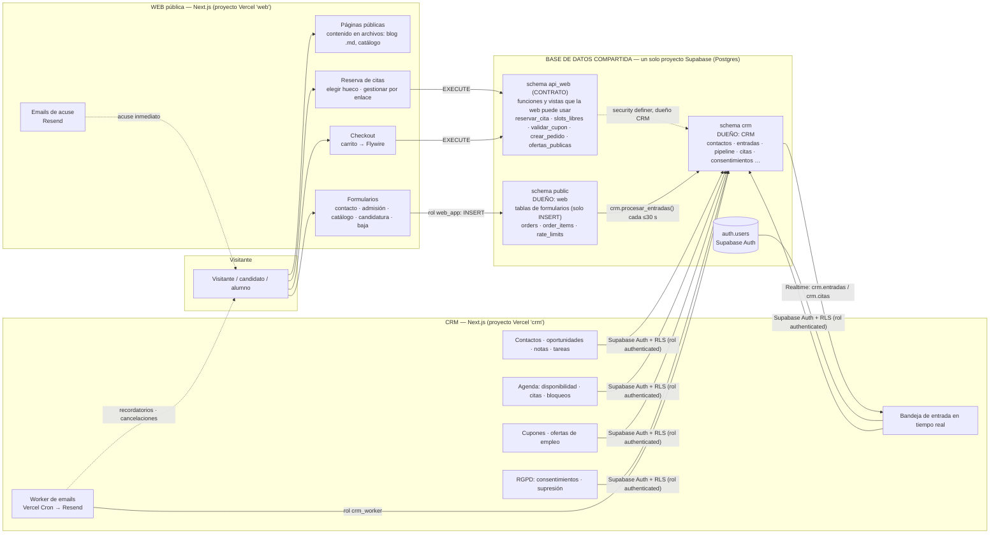
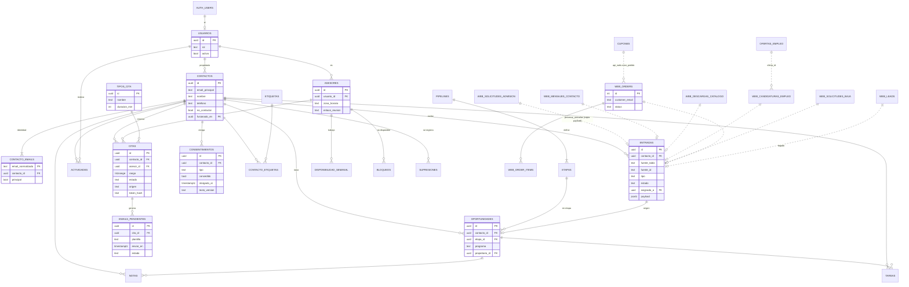
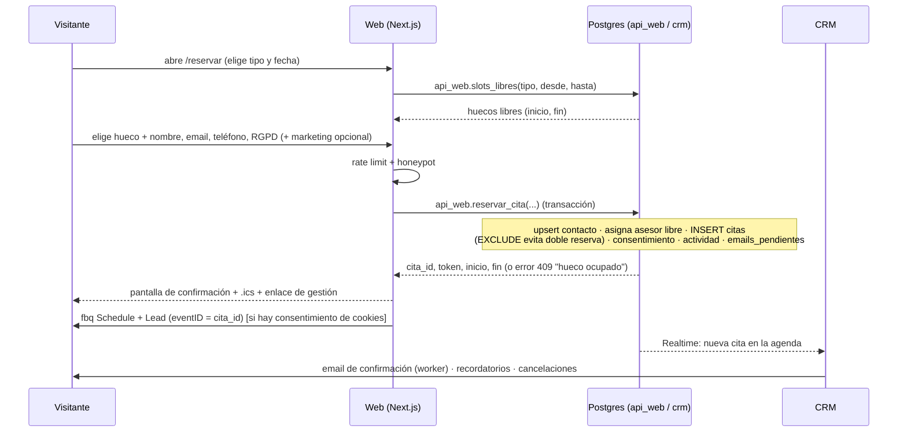
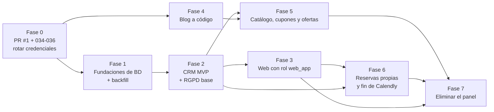

# Diseño del CRM de IDESIE y de la web solo pública

- **Fecha:** 2026-09-26
- **Alcance:** SOLO DISEÑO. No se ha modificado código de la aplicación, no se ha ejecutado nada contra la base de datos y ninguna migración está escrita. Los bloques SQL de este documento son **bocetos de diseño**, no probados (no hay Postgres local ni acceso a la BD).
- **Archivos entregados junto a este documento** (no ejecutados):
  - `docs/diseno-crm/backfill-contactos.sql` — crea los contactos históricos y el informe de duplicados (termina en `ROLLBACK`).
  - `docs/diseno-crm/exportar-blog.mjs` — exporta el blog de la BD a archivos `.md` (simulación por defecto; sintaxis verificada con `node --check`).
- **Base de partida:** `docs/auditoria-formularios-y-datos.md`, `crm-integration/` y el código actual (rama `security/critical-fixes-2026-09`, PR #1 sin fusionar).
- **Decisiones ya tomadas (no se discuten):** CRM separado pero con la **misma base de datos Supabase**; web solo pública; panel `/admin` y `/blog/edit` eliminados; blog en archivos del repositorio; Calendly sustituido por reservas propias gestionadas desde el CRM.
- **⚠️ POR VERIFICAR** = depende de datos que no tengo. Los resultados de las consultas SQL de producción (incluida la lista de tablas) **no llegaron**: el bloque `[PEGA AQUÍ…]` estaba sin rellenar. Todo el diseño se apoya en las migraciones del repositorio (`scripts/020`–`036`), que no tienen registro de qué está realmente aplicado.

---

## 1. Arquitectura general

### 1.1 Diagrama



### 1.2 Qué hace y qué NO hace cada aplicación

| | **Web (idesie.com)** | **CRM** |
|---|---|---|
| **Hace** | Servir contenido público (páginas, blog y catálogo desde archivos). Recoger los formularios (solo `INSERT`). Mostrar huecos de reserva y crear/cancelar/reprogramar citas (vía funciones del contrato). Checkout: verificar precio y crear el pedido, redirigir a Flywire. Enviar el **email de acuse** inmediato al usuario (Resend). Disparar Meta Pixel/CAPI. Rate limiting y honeypot | Autenticación y roles del equipo. Bandeja de todo lo que entra por la web. Contactos únicos, oportunidades, pipeline, notas, tareas. Agenda y gestión de citas. Cupones y ofertas de empleo. RGPD (consentimientos, supresión, bajas). Worker de emails (recordatorios, cancelaciones, avisos internos). Importaciones (Calendly). Informes |
| **NO hace** | Ninguna pantalla de gestión. No lee datos personales de la BD (solo escribe). No tiene `service_role`. No contiene el blog ni el catálogo en BD | No sirve páginas públicas. No recibe input de visitantes. No procesa pagos. No aloja el contenido público (blog/catálogo). No modifica el esquema `public` sin coordinarlo con la web |
| **Credencial de BD** | Rol `web_app` (permisos mínimos) | Sesión del usuario (Supabase Auth → `authenticated` + RLS) y rol `crm_worker` para tareas de servidor |

Principio rector: **la web escribe, el CRM lee y decide.** Una fila que entra por la web nunca la modifica el CRM (el estado de gestión vive en tablas del CRM); una tabla del CRM nunca la toca la web salvo a través de una función del contrato.

---

## 2. Esquemas y propiedad de las tablas

### 2.1 Esquemas

| Esquema | Dueño | Contenido | Quién puede usarlo |
|---|---|---|---|
| `public` | **Web** | Tablas de entrada de formularios, pedidos, `rate_limits` | `web_app` (INSERT y poco más); el CRM solo a través de `crm.procesar_entradas()` |
| `api_web` | **CRM escribe, la web consume** (contrato versionado) | Funciones `security definer` y vistas que necesita la web | `web_app` (EXECUTE/SELECT) |
| `crm` | **CRM** | Todo el modelo del CRM | `authenticated` (con RLS) y `crm_worker`. La web: nada |
| `auth` | Supabase | Usuarios del CRM | Supabase Auth |

### 2.2 Tablas existentes: dueño, lectores y escritores

Leyenda — **Hoy:** situación actual. **Destino:** situación tras el proyecto.

| Tabla | Dueño (destino) | Escribe (destino) | Lee (destino) | Notas |
|---|---|---|---|---|
| `solicitudes_admision` | Web | `web_app` INSERT | `crm.procesar_entradas()` | Hoy la lee/escribe el panel (`estado`). La columna `estado` queda **obsoleta**: el estado pasa a `crm.entradas`/`oportunidades` |
| `mensajes_contacto` | Web | `web_app` INSERT | `crm.procesar_entradas()` | Hoy nadie la lee (solo email). `telefono` desde 034 |
| `descargas_catalogo` | Web | `web_app` INSERT | `crm.procesar_entradas()` | Hoy nadie la lee |
| `candidaturas_empleo` | Web | `web_app` INSERT | `crm.procesar_entradas()` | `cv_url` sin uso: excluir de los GRANT |
| `solicitudes_baja` (036) | Web | `web_app` INSERT | `crm.procesar_entradas()` | Ver §10 |
| `orders`, `order_items` | Web | `api_web.crear_pedido()` | `crm.procesar_entradas()`; pago: ver §12 (falta webhook de Flywire) | Hoy `web` con `service_role`. `order_items.product_id` sin FK |
| `leads` | **Congelada** (legado) | nadie | solo el backfill | Sin consumidores. Ver §7.6 |
| `rate_limits` (035) | Web | `api_web.rate_limit_hit()` | nadie | El reinicio tras login (`resetRateLimit`) desaparece con el login |
| `coupons` | **CRM** (`crm.cupones`) | CRM (módulo Cupones) | `api_web.validar_cupon()` / `crear_pedido()` | Hoy solo SQL manual, sin UI. Se mueve |
| `ofertas_empleo` | **CRM** (`crm.ofertas_empleo`) | CRM (módulo Empleo) | web vía vista `api_web.v_ofertas_publicas` | La web pública las lee; hoy las gestiona el panel |
| `productos` + 7 tablas de detalle | **Se eliminan** (catálogo a código, §8.3) | — | — | Alternativa: esquema `catalogo` del CRM |
| `blog_posts` | **Se elimina** (§9) | — | — | Tras exportar y verificar |
| `admin_users`, `admin_sessions` | **Se eliminan** | — | — | Sustituidas por Supabase Auth + `crm.usuarios` |
| `applications` | Ya eliminada (031) | — | — | ⚠️ POR VERIFICAR que el `DROP` se ejecutó |

### 2.3 Tablas que sobran tras eliminar el panel y el blog en BD

`admin_users`, `admin_sessions`, `blog_posts`, `leads` (tras 6 meses de congelación), y —si el catálogo pasa a código— `productos`, `producto_modulos`, `modulo_temas`, `producto_dirigido`, `producto_objetivos`, `producto_faqs`, `producto_requisitos`, `producto_testimonios`. También dejan de servir: la columna `estado` de `solicitudes_admision`, `status` de `leads`, y `cv_url` de `solicitudes_admision`/`candidaturas_empleo`.
**No borrar nada** hasta cumplir la regla de §11.3 (30 días marcada como obsoleta, copia de seguridad y cero uso).

---

## 3. Roles y permisos

### 3.1 Dos hechos de Supabase que condicionan el diseño

1. **Por defecto Supabase concede `ALL` sobre las tablas de `public` a `anon`, `authenticated` y `service_role`**, y las funciones nuevas son ejecutables por `PUBLIC`. Con RLS activado y sin policies no se ve nada, pero un solo `CREATE POLICY` mal puesto abre la tabla. Hay que **revocar los permisos por defecto** y conceder solo lo necesario.
2. **La `anon key` está pensada para ser pública.** Si la web hiciera `INSERT` con `anon` + RLS, cualquiera con esa clave podría insertar directamente contra la API REST saltándose el rate limiting, el honeypot y la validación de la web. Por eso **la web no debe usar `anon`** ni `service_role`.

### 3.2 Cómo accede la web (recomendación)

| Opción | Cómo | Pros | Contras |
|---|---|---|---|
| **A. Rol `web_app` por conexión Postgres (recomendada)** | La web se conecta al *pooler* de Supabase (Supavisor, modo transacción, puerto 6543) con un rol propio y una contraseña propia (`WEB_DATABASE_URL`). Driver: `postgres` (postgres.js) con `prepare: false`, `max: 1` por función | Permisos exactos a nivel de Postgres. La web **no tiene ninguna clave de Supabase** (ni anon ni service_role). Se puede **desactivar la Data API para `public`** (la anon key deja de servir para nada). Transacciones reales (pedido + líneas; formulario + consentimiento). Una fuga de credencial solo permite INSERT en 5 tablas | Nueva dependencia y ~10 consultas que reescribir (hoy usan `supabase-js`). ⚠️ POR VERIFICAR: formato de usuario del pooler (`web_app.<project-ref>`), IPv4/IPv6 desde Vercel y límites de conexiones del plan |
| B. `supabase-js` + `anon` + RLS de INSERT | Sin cambios de librería | Cambio mínimo | La `anon key` es pública → saltarse los controles de la web. Sin transacciones. **Descartada** |
| C. `supabase-js` con JWT propio de rol `web_app` | Firmar un JWT con `role: web_app` | Mantiene supabase-js | Firmarlo exige el secreto JWT del proyecto, que también permite falsificar `service_role`: no reduce riesgo. **Descartada** |

**Recomendación: A.** Dónde la web deja de usar `service_role`: **en todas partes**. Tras eliminar el panel no queda ninguna lectura de gestión ni escritura privilegiada. `SUPABASE_SERVICE_ROLE_KEY` y `NEXT_PUBLIC_SUPABASE_*` desaparecen del entorno de la web.

### 3.3 Preparación (migración 037) — boceto

```sql
-- 037_db_roles_y_esquemas.sql  (BOCETO; las contraseñas se pasan por variable de psql, nunca en el archivo)
create schema if not exists crm;
create schema if not exists api_web;

-- Dueño de los objetos del CRM y de las funciones "security definer" (nologin).
create role crm_owner nologin;
grant crm_owner to postgres;
alter schema crm owner to crm_owner;
alter schema api_web owner to crm_owner;

create role web_app    login noinherit connection limit 30 password :'web_app_password';
create role crm_worker login noinherit connection limit 10 password :'crm_worker_password';
alter role web_app    set statement_timeout = '5s';
alter role web_app    set idle_in_transaction_session_timeout = '10s';
alter role crm_worker set statement_timeout = '60s';

-- 1) QUITAR los permisos por defecto de Supabase sobre public
revoke all on all tables    in schema public from anon, authenticated;
revoke all on all sequences in schema public from anon, authenticated;
revoke execute on all functions in schema public from public, anon, authenticated;
alter default privileges in schema public revoke all on tables    from anon, authenticated;
alter default privileges in schema public revoke all on sequences from anon, authenticated;
alter default privileges in schema public revoke execute on functions from public, anon, authenticated;
-- Repetir los ALTER DEFAULT PRIVILEGES "for role supabase_admin" si crea objetos. ⚠️ POR VERIFICAR el rol creador real.

-- 2) crm y api_web: nada para anon
revoke all on schema crm     from public, anon;
revoke all on schema api_web from public, anon, authenticated;
alter default privileges in schema crm     revoke execute on functions from public;
alter default privileges in schema api_web revoke execute on functions from public;
```

### 3.4 Rol `web_app`: GRANT exactos (migración 042) — boceto

```sql
grant usage on schema public, api_web to web_app;

-- INSERT limitado a COLUMNAS: la web no puede fijar id, estado ni fechas.
-- (Tras la migración 040 de consentimiento se añaden las 3 columnas nuevas a cada lista.)
grant insert (nombre, email, telefono, asunto, mensaje, motivo, programa,
              consentimiento_at, consentimiento_version, marketing_aceptado)
  on public.mensajes_contacto to web_app;

grant insert (nombre_completo, email, telefono, pais, ciudad, fecha_nacimiento,
              titulacion_previa, universidad_origen, programa_solicitado, origen, mensaje,
              rgpd_aceptado, consentimiento_at, consentimiento_version, marketing_aceptado)
  on public.solicitudes_admision to web_app;

grant insert (nombre, email, telefono, catalogo_id, catalogo_nombre, programa,
              rgpd_aceptado, consentimiento_at, consentimiento_version, marketing_aceptado)
  on public.descargas_catalogo to web_app;

grant insert (oferta_id, oferta_puesto, nombre, email, telefono, mensaje,
              consentimiento_at, consentimiento_version)          -- sin cv_url
  on public.candidaturas_empleo to web_app;

grant insert (email, motivo) on public.solicitudes_baja to web_app;

-- RLS: activado en todas; policy de solo INSERT para web_app (sin SELECT ⇒ sin RETURNING)
alter table public.mensajes_contacto     enable row level security;
alter table public.solicitudes_admision  enable row level security;
alter table public.descargas_catalogo    enable row level security;
alter table public.candidaturas_empleo   enable row level security;
alter table public.solicitudes_baja      enable row level security;

create policy web_app_insert on public.mensajes_contacto    for insert to web_app with check (true);
create policy web_app_insert on public.solicitudes_admision for insert to web_app with check (true);
create policy web_app_insert on public.descargas_catalogo   for insert to web_app with check (true);
create policy web_app_insert on public.candidaturas_empleo  for insert to web_app with check (true);
create policy web_app_insert on public.solicitudes_baja     for insert to web_app with check (true);

-- Lógica con reglas de negocio → funciones del contrato (dueño crm_owner, security definer,
-- search_path fijo). La web solo puede EJECUTARLAS.
grant execute on function
  api_web.rate_limit_hit(text, text, integer, integer),          -- movida desde public (035)
  api_web.validar_cupon(text, numeric),
  api_web.crear_pedido(jsonb),                                    -- orders + order_items + uso de cupón, en una transacción
  api_web.slots_libres(uuid, date, date),
  api_web.reservar_cita(uuid, timestamptz, text, text, text, text, text, boolean, jsonb),
  api_web.ver_cita(text), api_web.cancelar_cita(text, text), api_web.reprogramar_cita(text, timestamptz)
to web_app;
grant select on api_web.v_ofertas_publicas to web_app;            -- vista de solo lectura (ofertas activas)
```

Consecuencias para el código de la web (a nivel de diseño):
- **Nada de `INSERT … RETURNING`** ni `.select("id")`: `web_app` no tiene `SELECT`. Hoy los endpoints devuelven `id` en la respuesta; no es necesario y se elimina.
- Los `id` son `uuid default gen_random_uuid()`: no hace falta devolverlos.
- Las tablas de contenido público (`productos`…) **ya no se leen de BD** (catálogo a código); solo `api_web.v_ofertas_publicas`.

### 3.5 Rol del CRM: usuarios (`authenticated`) y `crm_worker`

```sql
-- Identidad: Supabase Auth. La tabla crm.usuarios (§6) dice qué rol tiene cada uno.
create or replace function crm.rol_actual() returns text
language sql stable security definer set search_path = ''
as $$ select u.rol::text from crm.usuarios u where u.id = (select auth.uid()) and u.activo $$;
revoke execute on function crm.rol_actual() from public, anon;
grant  execute on function crm.rol_actual() to authenticated;

grant usage on schema crm to authenticated, crm_worker;

-- Lectura para cualquier miembro activo; escritura según rol (policy) — patrón por tabla:
alter table crm.contactos enable row level security;
grant select, insert, update on crm.contactos to authenticated;
create policy c_leer   on crm.contactos for select to authenticated using (crm.rol_actual() is not null);
create policy c_crear  on crm.contactos for insert to authenticated with check (crm.rol_actual() in ('admin','comercial'));
create policy c_editar on crm.contactos for update to authenticated
  using (crm.rol_actual() in ('admin','comercial')) with check (crm.rol_actual() in ('admin','comercial'));
-- DELETE no se concede: el borrado de personas SOLO ocurre por crm.suprimir_contacto() (admin + MFA).
```

Matriz de privilegios del CRM (las policies concretas siguen el patrón anterior):

| Tabla `crm.*` | `authenticated` (por rol) | `crm_worker` |
|---|---|---|
| `usuarios` | SELECT propia fila (todos); ALL solo `admin` | SELECT |
| `contactos`, `contacto_emails`, `oportunidades`, `notas`, `tareas`, `etiquetas`, `contacto_etiquetas` | SELECT: todos · INSERT/UPDATE: `admin`, `comercial` · DELETE: solo `admin` (notas/tareas/oportunidades; nunca `contactos`) | ALL |
| `entradas` | SELECT: todos · UPDATE (`estado`, `asignado_a`, `leida_at`): `admin`, `comercial` · INSERT/DELETE: nadie (solo `procesar_entradas`) | INSERT, UPDATE |
| `actividades` | SELECT: todos · INSERT: `admin`, `comercial` · UPDATE/DELETE: **nadie** (historial inmutable) | INSERT |
| `consentimientos`, `supresiones` | SELECT: `admin` · escritura: solo funciones | INSERT |
| `asesores`, `tipos_cita`, `disponibilidad_semanal`, `bloqueos` | SELECT: todos · escritura: `admin` (los `bloqueos` propios también `comercial`) | SELECT |
| `citas` | SELECT: todos · INSERT/UPDATE: `admin`, `comercial` | ALL |
| `emails_pendientes`, `plantillas_email` | SELECT: `admin` · escritura: `admin` (plantillas) | ALL |
| `cupones`, `ofertas_empleo`, `pipelines`, `etapas` | SELECT: todos · escritura: `admin` | SELECT |

El **service_role no se usa en el CRM salvo** para crear/invitar usuarios de Auth (API de administración) y solo en código de servidor.
Operaciones destructivas o sobre PII masiva (`suprimir_contacto`, importaciones, fusión) → funciones `security definer` con `crm_owner` como dueño y comprobación de rol **y MFA** (`(auth.jwt()->>'aal') = 'aal2'`) dentro.

---

## 4. Contactos unificados

### 4.1 Tabla `crm.contactos` y clave de identidad

- **Identidad = email normalizado** (`lower(btrim(email))`). No se usa el email "tal cual" como clave.
- Un contacto puede tener **varios emails** (alias tras una fusión o un cambio) → tabla `crm.contacto_emails(email_normalizado PK, contacto_id, principal)`. **Esa tabla es el índice de identidad**: cualquier entrada nueva busca su email ahí.
- Fusión de duplicados: manual, por función `crm.fusionar_contactos(origen, destino)`, que reasigna entradas/oportunidades/notas/tareas/citas/consentimientos al destino, mueve los emails del origen a `contacto_emails` del destino y marca `origen.fusionado_en = destino`. **Nunca se fusiona automáticamente por teléfono o nombre**; solo lo exacto por email es automático.

```sql
-- BOCETO (038)
create function crm.normalizar_email(t text) returns text language sql immutable as $$ select lower(btrim(t)) $$;

create table crm.contactos (
  id uuid primary key default gen_random_uuid(),
  email_principal text not null,
  nombre text, telefono text,
  telefono_digitos text generated always as (nullif(regexp_replace(coalesce(telefono,''), '\D', '', 'g'), '')) stored,
  pais text, ciudad text,
  propietario_id uuid references crm.usuarios(id),
  origen_primero text,                       -- tipo de la primera entrada
  no_contactar boolean not null default false,   -- oposición / baja de comunicaciones
  baja_solicitada_at timestamptz,
  suprimido_at timestamptz,                  -- tras crm.suprimir_contacto (fila anonimizada)
  fusionado_en uuid references crm.contactos(id),
  creado_at timestamptz not null default now(),
  actualizado_at timestamptz not null default now()
);
create table crm.contacto_emails (
  email_normalizado text primary key,
  contacto_id uuid not null references crm.contactos(id) on delete cascade,
  principal boolean not null default false
);
create unique index on crm.contacto_emails (contacto_id) where principal;
```

### 4.2 Vinculación con las tablas de la web: trigger vs vista vs proceso del CRM

Tablas a vincular: `leads`, `solicitudes_admision`, `mensajes_contacto`, `descargas_catalogo`, `candidaturas_empleo`, `orders`, `solicitudes_baja`.

| Criterio | **Trigger** `AFTER INSERT` en cada tabla web | **Vista** `UNION ALL` de las 7 tablas | **Proceso del CRM** (función idempotente + cron) |
|---|---|---|---|
| Latencia | Instantánea | Instantánea (consulta en vivo) | ≤ 30 s (cron) o inmediata si el CRM la invoca al abrir la bandeja |
| ¿Puede romper la web? | **Sí**: un fallo de la función del CRM en el trigger rompe el `INSERT` de la web (o, si se traga la excepción, pierde el vínculo en silencio). La web necesitaría privilegios sobre `crm` | **No** | **No**: la web ni sabe que existe |
| Acoplamiento de esquemas | Alto: el CRM cambia y afecta a la web | Alto en columnas (si la web renombra una columna, la vista se rompe) | Bajo si la lectura está aislada en una vista-contrato |
| Guarda estado (fusión, dueño, estado de gestión) | Sí | **No** (no puede guardar nada) | Sí |
| Reintentos / idempotencia | Difícil | No aplica | Natural: `unique(fuente_tabla, fuente_id)` + marca de agua |
| Complejidad operativa | Baja pero frágil | Muy baja | Media (un job) |
| Es lo que ya proponía `crm-integration/` | Sí (trigger + `pg_net` + HMAC) | No | No |

**Recomendación: proceso del CRM que lee de una vista-contrato.** Concretamente:
1. `crm.v_entradas_web` (vista, dueño `crm_owner`): `UNION ALL` de las 7 tablas normalizando columnas a `(fuente_tabla, fuente_id, tipo, email_norm, nombre, telefono, programa, recibido_at, rgpd, raw jsonb)`. **Es el único sitio que conoce las columnas de la web.**
2. `crm.procesar_entradas()` (función `security definer`, idempotente): por cada fila de la vista que no esté en `crm.entradas` → busca/crea contacto por `contacto_emails`, inserta la `entrada` (con `payload = raw`), aplica las reglas de alta (§5.2) y escribe `actividades`. Se ejecuta con `pg_cron` cada 30 s (⚠️ POR VERIFICAR versión de `pg_cron` que admite segundos; si no, cada minuto) y **además** el CRM la invoca al abrir/reenfocar la bandeja (llamada barata) → efecto práctico casi instantáneo.
3. Sin triggers en tablas de la web. Descartado el diseño `pg_net` + HMAC + segundo proyecto de `crm-integration/`: era necesario solo porque las bases eran distintas.

**Regla para las bajas:** una entrada de tipo `baja` se vincula al contacto si existe, lo marca `no_contactar` y crea la tarea de supresión (§10); **no crea un contacto comercial nuevo** por sí sola (se crea "vacío" solo para poder trazar la petición).

### 4.3 Qué se reaprovecha de `crm-integration/`

| Pieza | Decisión |
|---|---|
| `upsert_contact()` con `COALESCE` real (no sobrescribir nombre/teléfono con NULL) | **Reutilizar la idea**: `procesar_entradas` rellena solo lo vacío |
| `sources`, `submissions.idempotency_key`, `payload jsonb` | **Reutilizar**: pasa a `crm.entradas(unique fuente_tabla+fuente_id, payload)`; `sources` no hace falta (una sola web) |
| Edge Function `crm-ingest`, HMAC, `crm_sync_log`, `pg_net`, trigger y cron de reintento | **Descartado** |
| Mapeo real de columnas por tabla (`first_name+last_name` en `leads`, `nombre_completo`…) | **Reutilizar** dentro de `v_entradas_web` y del backfill |

### 4.4 Backfill

`docs/diseno-crm/backfill-contactos.sql` (sin ejecutar):
- Unifica las 7 tablas en una tabla temporal, **excluye filas de prueba** (patrón `PRUEBA-PREVIEW` buscado en **cualquier columna** de la fila; lista ampliable) y las que no tienen un email con forma válida (van a un informe).
- Crea contactos (nombre más completo, teléfono más reciente, primera vez, origen), `contacto_emails`, `entradas` (las de los últimos 30 días quedan `nueva`; el histórico `gestionada`) y consentimientos ya existentes (casilla RGPD marcada, versión `desconocida-anterior-al-crm`).
- **Informe de duplicados**: mismo email en varias tablas (fusionados), repetidos en la misma tabla, y **posibles** duplicados no fusionados por mismo teléfono (9 últimos dígitos), mismo Gmail ignorando puntos/`+alias`, o mismo nombre. Todo dentro de una transacción que acaba en `ROLLBACK` por defecto.
- Idempotente y de solo lectura sobre `public.*`. ⚠️ POR VERIFICAR: marcador real de las pruebas, nombres de columna reales y ausencia de otras tablas con personas (la lista de tablas de producción no llegó).

---

## 5. Modelo de datos del CRM

### 5.1 Pipeline y estados

Dos pipelines configurables (tabla `pipelines`/`etapas`, editables por `admin`):

- **Admisión** (comercial): `Nuevo` → `Contactado` → `Sesión informativa agendada` → `Sesión realizada` → `Solicitud recibida` → `Entrevista/Revisión` → `Admitido` → **`Matriculado`** (ganada) · `Perdido` (motivo obligatorio) · `Descartado`.
  Mapea los estados actuales: `leads.status` (`nuevo/contactado/cualificado/matriculado/descartado`) y `solicitudes_admision.estado` (`pendiente/revisado/aceptado/rechazado`).
- **Empleo** (candidaturas): `Recibida` → `En revisión` → `Contactada` → `Archivada`.

**Estado de una entrada** (`crm.entradas.estado`): `nueva` → `en_gestion` → `gestionada` | `descartada`. Es lo que sustituye al `estado` que hoy cambia el panel en `solicitudes_admision`.

**Reglas de alta automática** (dentro de `procesar_entradas`, configurables):

| Entrada | Efecto |
|---|---|
| `solicitud_admision` | Contacto + oportunidad en «Solicitud recibida» (si no hay una abierta del mismo programa) + tarea «Revisar solicitud» (vence a las 48 h) |
| `cita` (reserva) | Contacto + oportunidad en «Sesión informativa agendada» |
| `mensaje_contacto` | Contacto + tarea «Responder» (24 h) |
| `descarga_catalogo` | Contacto + etiqueta `catálogo-<programa>` (sin oportunidad automática; se puntúa como interés) |
| `candidatura` | Contacto (tipo candidato) + oportunidad en pipeline Empleo |
| `pedido` | Contacto + actividad «Pedido» (estado de pago: ver §12) |
| `baja` | `no_contactar` + tarea de supresión (§10) |

### 5.2 Tablas del CRM (resumen; DDL completo se escribe en las migraciones 038–041)

| Tabla | Para qué | Campos clave |
|---|---|---|
| `crm.usuarios` | Miembros del equipo, ligados a Auth | `id` (= `auth.users.id`), `nombre`, `rol` (`admin`/`comercial`/`lectura`), `activo` |
| `crm.contactos`, `contacto_emails` | Personas | ver §4.1 |
| `crm.entradas` | Todo lo que llega de la web + estado de gestión | `contacto_id`, `fuente_tabla`, `fuente_id` (text), `tipo`, `programa`, `recibido_at`, `estado`, `asignado_a`, `leida_at`, `payload jsonb`; **unique(`fuente_tabla`,`fuente_id`)** |
| `crm.pipelines`, `etapas` | Configuración del embudo | `etapas.orden`, `tipo` (`abierta`/`ganada`/`perdida`) |
| `crm.oportunidades` | Un interés concreto de una persona | `contacto_id`, `pipeline_id`, `etapa_id`, `programa`, `propietario_id`, `valor`, `entrada_origen_id`, `cerrada_at`, `motivo_perdida` |
| `crm.notas` | Notas libres | `contacto_id`, `oportunidad_id?`, `autor_id`, `texto` |
| `crm.actividades` | Historial **inmutable** (línea de tiempo) | `contacto_id`, `oportunidad_id?`, `entrada_id?`, `cita_id?`, `usuario_id?`, `tipo` (`entrada_web`, `nota`, `llamada`, `email`, `cita`, `cambio_etapa`, `cambio_estado`, `tarea`, `sistema`), `datos jsonb`, `ocurrio_at` |
| `crm.tareas` | Seguimiento | `contacto_id`, `oportunidad_id?`, `asignado_a`, `titulo`, `vence_at`, `completada_at`, `creado_por` |
| `crm.etiquetas`, `contacto_etiquetas` | Segmentación | |
| `crm.consentimientos` | Prueba de consentimiento | ver §10 |
| `crm.supresiones` | Registro de derecho de supresión | `contacto_id`, `email_hash`, `ejecutado_por`, `ejecutado_at`, `resumen jsonb` |
| `crm.asesores`, `tipos_cita`, `disponibilidad_semanal`, `bloqueos`, `citas` | Reservas | ver §7 |
| `crm.emails_pendientes`, `plantillas_email` | Cola de envío (outbox) | ver §7.4 |
| `crm.cupones`, `crm.ofertas_empleo` | Módulos que hoy hace el panel/SQL | ver §8 |

### 5.3 Cómo ve el CRM en tiempo real lo que entra por la web

| Mecanismo | Latencia | Pros | Contras |
|---|---|---|---|
| **Supabase Realtime `postgres_changes` sobre `crm.entradas` y `crm.citas`** + `procesar_entradas` por cron/al enfocar | ≤ 30 s (normalmente segundos si alguien tiene la bandeja abierta) | Respeta RLS; sin trigger en tablas de la web; sin infraestructura nueva | Depende de Realtime (⚠️ POR VERIFICAR cuota del plan); hay que añadir las tablas a la publicación `supabase_realtime` |
| Polling cada 30–60 s (`SWR`/`react-query`) | 30–60 s | Trivial, robusto | Algo más de carga |
| Realtime directo sobre `public.*` | Instantánea | Sin espera del proceso | Hay que dar `SELECT` a `authenticated` sobre tablas con PII de la web y modificar la publicación de esas tablas (acopla) |

**Recomendación:** Realtime sobre `crm.entradas`/`crm.citas` **más** polling de respaldo cada 60 s (por si se cae el socket). Aviso visual (contador de «nuevas», sonido opcional) y notificación por email interna opcional.

### 5.4 Diagrama entidad-relación



---

## 6. Acceso al CRM

Supabase Auth con **invitación** (registro público desactivado) y lista de dominios permitidos (`@idesie.com` ⚠️ POR VERIFICAR qué dominios/correos usa el equipo). Autenticación por email + contraseña y **MFA TOTP obligatorio para `admin`**. Las sesiones son de Supabase (JWT de corta duración + refresh); **sustituyen a `admin_users`/`admin_sessions`, a la "clave secreta compartida" y a la firma propia (`ADMIN_SESSION_SECRET`)**. Cada acción queda ligada a `auth.uid()` (auditoría por persona, cosa que hoy no existe).

| Capacidad | `admin` | `comercial` | `lectura` |
|---|---|---|---|
| Ver bandeja, contactos, oportunidades, citas, notas | ✅ | ✅ | ✅ |
| Crear/editar contactos, oportunidades, notas, tareas | ✅ | ✅ | ❌ |
| Cambiar estado de entradas y mover etapas | ✅ | ✅ | ❌ |
| Gestionar citas (crear, mover, cancelar) y sus propios bloqueos | ✅ | ✅ | ❌ |
| Fusionar contactos | ✅ | ✅ (confirmación) | ❌ |
| Configurar pipeline, tipos de cita, disponibilidad de otros, plantillas de email | ✅ | ❌ | ❌ |
| Cupones, ofertas de empleo | ✅ | ❌ | ❌ |
| Ver consentimientos y registro de supresiones | ✅ | ❌ | ❌ |
| **Ejecutar supresión RGPD** (requiere MFA en la sesión) | ✅ | ❌ | ❌ |
| Gestionar usuarios y roles | ✅ | ❌ | ❌ |
| Exportar datos masivamente | ✅ | ❌ | ❌ |

⚠️ Decisión pendiente: si `comercial` ve **todos** los contactos o solo los suyos (ver §13).

---

## 7. Sistema de reservas propio (sustituto de Calendly)

### 7.1 Tablas (esquema `crm`, migración 044)

```sql
create extension if not exists btree_gist;  -- ⚠️ POR VERIFICAR disponible en el plan

asesores(id, usuario_id fk, nombre, zona_horaria default 'Europe/Madrid', enlace_reunion, activo)
tipos_cita(id, nombre, duracion_min, buffer_min, antelacion_min_horas, max_dias_futuro,
           granularidad_min default 30, modalidad, publico boolean, activo)
disponibilidad_semanal(id, asesor_id, tipo_cita_id null, dia_semana 1..7,
                       hora_inicio time, hora_fin time, vigente_desde, vigente_hasta)
bloqueos(id, asesor_id, rango tstzrange, motivo)                 -- vacaciones, festivos
citas(id, contacto_id, asesor_id null, tipo_cita_id, rango tstzrange, estado, origen,
      programa, utm jsonb, enlace_reunion, token_hash text unique, creada_por,
      cancelada_at, motivo_cancelacion, calendly_uri text unique,   -- histórico importado
      creado_at)
  -- estado: confirmada | cancelada | completada | no_show
  -- Evita doble reserva del mismo asesor (esto REEMPLAZA al índice único por hora de 'leads'):
  exclude using gist (asesor_id with =, rango with &&) where (estado = 'confirmada')
```

Hueco libre = horario semanal del asesor (en su zona horaria) − bloqueos − citas confirmadas (± *buffer*) − antelación mínima. Todo se guarda en `timestamptz`; el visitante ve las horas en **su** zona (Intl del navegador) y el email incluye la hora en ambas.

### 7.2 Flujo en la web (funciones del contrato `api_web`)



- El **token de gestión** (32 bytes aleatorios) se devuelve **una vez** a la web; en BD solo su hash. Enlace `/reservas/<token>` → `ver_cita`, `cancelar_cita`, `reprogramar_cita` (misma comprobación de disponibilidad y de antelación mínima).
- Asignación de asesor: el que tenga el hueco libre con menos citas ese día (⚠️ decisión si hay un solo asesor).
- Error de doble reserva → `23P01` (exclusion violation) → la web responde 409 y refresca los huecos.

### 7.3 Gestión desde el CRM

Vista de agenda (día/semana por asesor), alta manual de citas (llamada entrante), mover/cancelar (envía el email correspondiente), marcar `completada`/`no_show` (alimenta el pipeline: «Sesión realizada»), bloqueos y horarios propios, configuración de tipos de cita (admin). Cada cambio genera una `actividad`.

### 7.4 Emails: confirmación, recordatorio y cancelación

- **Cola (`crm.emails_pendientes`)** con `plantilla`, `destinatario`, `datos jsonb`, `enviar_en`, `estado` (`pendiente/enviado/error/cancelado`), `intentos`. Las filas las crean las funciones al reservar/mover/cancelar.
- **Worker en el CRM** (ruta protegida de Vercel Cron cada minuto → Resend). Enviar 1 min tarde es aceptable; el **acuse inmediato en pantalla** lo da la web.
- Plantillas: **confirmación** (inmediata, con `.ics` y enlace de gestión), **recordatorio 24 h** y **1 h** (se cancelan si la cita se cancela o mueve), **cancelación** y **reprogramación**, y **aviso interno** al asesor.
- Al cancelar/mover, se marcan `cancelado` los recordatorios pendientes de esa cita.
- Reutilizar `emails/*.tsx` (React Email, hoy sin uso) como base de las plantillas en el CRM.
- El remitente único `RESEND_FROM_EMAIL` (ya en el PR #1) se comparte. ⚠️ POR VERIFICAR dominio verificado en Resend.
- Enlace de videollamada: **fase 1** enlace fijo por asesor (`asesores.enlace_reunion`); **fase 2** (opcional) Google Calendar/Meet por asesor con lectura de disponibilidad ocupada. Calendly resolvía esto solo: es lo que más trabajo añade (decisión §13).

### 7.5 Meta Pixel: mantener `Schedule` y `Lead`

- Hoy se disparan en el navegador al recibir el `postMessage` de Calendly. Con el sistema propio se disparan **cuando la respuesta de `reservar_cita` es correcta** (no al hacer clic): `fbq('track','Schedule',{}, {eventID: <cita_id>})` y `fbq('track','Lead',{}, {eventID: 'lead-<cita_id>'})`.
- **Recomendado además:** la API de Conversiones (CAPI) desde el servidor de la web con el **mismo `event_id`** para deduplicar y sobrevivir a bloqueadores (`META_CAPI_TOKEN`, email con hash SHA-256). Los formularios de admisión y de catálogo ya disparan `Lead`; añadir el mismo `event_id` a sus filas.
- **Condición RGPD:** cargar el píxel solo con consentimiento de cookies de marketing. Hoy **no hay banner** (ver §10): es un requisito previo, no opcional.

### 7.6 ¿Reutilizar la tabla `leads` o crear una nueva?

**Crear `crm.citas` y congelar `leads`.** Motivos: `leads` mezcla los datos de la persona con la cita (desnormalizado); su restricción de unicidad asume 10 franjas fijas y una sola persona; su `status` duplica el pipeline; vive en el esquema de la web; y no tiene asesor, zona horaria, cancelación ni token. `leads` se queda como **archivo histórico** (se vuelca en `crm.entradas` con el backfill), sin escrituras, y se elimina a los 6 meses.

### 7.7 Historial de Calendly

- Exportar desde Calendly (Eventos programados → exportar CSV, o la API con un token personal) — ⚠️ POR VERIFICAR el formato real de la exportación y qué plan de Calendly la permite.
- Importar a `crm.citas` con `origen='calendly'`, `calendly_uri` único (idempotente), asesor por email del anfitrión (`asesor_id` nulo si no coincide con un usuario del CRM), `estado` = `completada` si la fecha ya pasó y no fue cancelada, `cancelada` si lo fue. El invitado se vincula por email (`upsert` de contacto) y genera una `entrada` tipo `cita`; las respuestas a preguntas de Calendly van a `notas`.
- **Corte:** Calendly se mantiene hasta que pase la última cita futura ya agendada; esas citas futuras se importan como `confirmada` para que reciban el recordatorio nuevo. Después se cancela la cuenta.
- Script de importación: se escribe en la fase de reservas (no se entrega ahora: depende del formato de exportación).

---

## 8. Eliminación del panel de administración

### 8.1 Inventario de lo que hace hoy el panel (leído del código)

| Área | Rutas | Lecturas | Escrituras / acciones | Destino |
|---|---|---|---|---|
| **Acceso** | `/admin/login`, `POST/DELETE /api/admin/auth`, `middleware.ts`, `admin-bfcache-guard` | `admin_users`, `admin_sessions` | Login con clave compartida (bcrypt), crear/revocar sesión, `last_login` | **Desaparece** → Supabase Auth en el CRM |
| **Dashboard** | `/admin/dashboard` | Nº de posts (total, publicados, del mes), posts recientes, productos (total/activos), ofertas activas, candidaturas, solicitudes de admisión y pendientes | — | **CRM**: solo lo relevante (entradas nuevas, pendientes, citas de hoy). Blog y catálogo desaparecen |
| **Blog** | `/admin/posts`, `/new`, `/edit/[slug]`, `/blog/edit/[slug]` (duplicada y fuera de `/admin`) | `getAllBlogPosts`, `getBlogPostBySlug` | `createBlogPost`, `updateBlogPost`, `deleteBlogPost` (editor de texto enriquecido, tags, slug, imagen destacada por URL) | **Pasa a código** (§9) |
| **Tienda — producto** | `/admin/tienda`, `/nuevo`, `/[slug]/editar` | `getAdminProductos`, `getAdminProductoBySlug` | `createProducto`, `updateProducto`, `deleteProducto` (nombre, slug, tipo, precios, matrícula, duración, modalidad, certificación, categoría, imagen URL, destacado, activo, descripciones HTML) | **Pasa a código** (§8.3) |
| **Tienda — detalle** | pestañas dentro de `/[slug]/editar` | `getModulosConTemas`, `getListaItems` | `saveModulo`/`deleteModulo`/`reorderModulo`, `saveTema`/`deleteTema`/`reorderTema`, `saveListaItem`/`deleteListaItem`/`reorderListaItem` (dirigido, objetivos, FAQs, requisitos, testimonios) | **Pasa a código** (§8.3) |
| **Empleo — ofertas** | `/admin/empleo`, `/nueva`, `/[id]/editar` | `getAdminOfertas`, `getAdminOfertaById` | `createOferta`, `updateOferta`, `deleteOferta` (activa/destacada) | **CRM** (módulo Empleo) |
| **Empleo — candidaturas** | `/admin/empleo/candidaturas` | `getAdminCandidaturas` (búsqueda; enlace a CV siempre vacío hoy) | — (solo lectura) | **CRM** (entradas tipo `candidatura`) |
| **Admisiones** | `/admin/admisiones` | `getAdminSolicitudes` (búsqueda) | `updateEstadoSolicitud` (pendiente/revisado/aceptado/rechazado) | **CRM** (entradas + oportunidades). El estado deja de escribirse en la tabla de la web |
| **Cupones** | *(sin pantalla)* | — | Solo SQL manual (`scripts/008`, `010`) | **CRM** (módulo Cupones): hoy no existe UI |
| **Sin ninguna pantalla hoy** | — | — | `mensajes_contacto`, `descargas_catalogo`, `orders`/`order_items`, `solicitudes_baja` se reciben pero **nadie las ve** salvo por email/SQL | **CRM** (bandeja) — **mejora**, no pérdida |

### 8.2 Paridad de funciones (qué debe cubrir el CRM antes de borrar el panel)

Bloqueante para borrar el panel: **admisiones** (listar, buscar, cambiar estado), **candidaturas** (listar, buscar), **ofertas de empleo** (CRUD + publicar), **cupones** (crear/editar/desactivar), y el catálogo/blog ya migrados a código. Lo demás (login, dashboard de blog/productos) desaparece sin sustituto.

### 8.3 Tienda: cómo gestionarla sin el panel

**Estado actual:** 6 productos reales; `productos` (≈20 campos) + 7 tablas hijas con orden manual; datos completos de 3 másteres (p. ej. MBIM: 9 módulos, 22 temas, 6 requisitos, 9 FAQs). El checkout ya **recalcula el precio en servidor desde `productos`** y `order_items.product_id` referencia el `id` numérico (sin FK).

| | **A. Catálogo en código (recomendada)** | B. Catálogo gestionado desde el CRM (`schema catalogo`) |
|---|---|---|
| Cómo | `content/productos/<slug>.md` con frontmatter validado con zod (datos base + arrays de módulos/temas, dirigido, objetivos, FAQs, requisitos, testimonios) y el cuerpo = descripción larga. `lib/catalogo.ts` lo carga en build | El CRM incorpora los 4 editores (producto, módulos+temas, listas ordenables, testimonios) escribiendo en tablas que la web solo lee (vista del contrato) |
| Pros | Coherente con el blog. Versionado y revisado por PR (los precios no cambian sin dejar rastro). Web 100 % estática y rápida, **sin dependencia de BD para el contenido** (cae el CRM y la tienda sigue). Elimina ~2.000 líneas de editores, 8 tablas y `sanitize-html` para la descripción. Se edita con Claude Code, como pidieron | Personal no técnico puede cambiar un precio o una FAQ sin desplegar. Cambio inmediato |
| Contras | Cada cambio de precio/contenido = commit + despliegue (~1–2 min). Un no-desarrollador no puede editarlo solo | Hay que reconstruir en el CRM ~1.500 líneas de editores con anidación. Aumenta la superficie: contenido público dependiente de la BD. Contradice el espíritu «web solo pública, sin datos de gestión» |
| Cambios asociados | `order_items` gana `producto_slug text` (aditivo); ids históricos se mapean a slug en un script (⚠️ POR VERIFICAR: solo consta `id 8 = master-bim-full-time`) | Migrar las 8 tablas a un esquema `catalogo` y dar `SELECT` a `web_app` |

**Recomendación: A**, dado que el catálogo son 6 productos que cambian poco y que el equipo trabajará con Claude Code. Si en algún momento un perfil no técnico tuviera que tocar precios con frecuencia, migrar a B sin rehacer la web (el contrato de lectura sería el mismo).
**Cupones** → `crm.cupones` (BD): cambian a menudo y son datos, no contenido. **Ofertas de empleo** → `crm.ofertas_empleo` (BD): cambian con frecuencia y las gestiona quien ya usa el CRM.

### 8.4 Qué se elimina

**Rutas y páginas**
`app/admin/**` (14 archivos: `layout`, `login`, `dashboard`, `posts/{,new,edit/[slug]}`, `tienda/{,nuevo,[slug]/editar}`, `empleo/{,nueva,[id]/editar,candidaturas}`, `admisiones`), `app/blog/edit/[slug]/page.tsx`, `app/api/admin/auth/route.ts`, `app/api/blog/latest/route.ts` (tras el blog en código), `app/api/productos/route.ts` (sin consumidor; solo si el catálogo va a código), `middleware.ts` (solo protegía `/admin`), entrada `Disallow: /admin/` de `app/robots.txt` (opcional).

**Server Actions** (`"use server"` con `requireAdmin`, 28 funciones)
- `app/blog/actions.ts`: `createBlogPost`, `updateBlogPost`, `deleteBlogPost`, `getAllBlogPosts` (y todo el archivo al pasar a archivos).
- `app/tienda/actions.ts`: `getAdminProductos`, `getAdminProductoBySlug`, `createProducto`, `updateProducto`, `deleteProducto` (+ `getPublicProductos`, según §8.3).
- `app/tienda/detalle-actions.ts` y `app/tienda/modulos-actions.ts` (10 funciones).
- `app/empleo/actions.ts`: `getAdminOfertas`, `getAdminOfertaById`, `createOferta`, `updateOferta`, `getAdminCandidaturas`, `deleteOferta` (queda `getPublicOfertas` → se sustituye por la vista del contrato).
- `app/admision/solicitudes-actions.ts` y `app/admision/actions.tsx` (código muerto).

**Componentes y librerías**
`components/admin-header.tsx`, `admin-bfcache-guard.tsx`, `blog-post-form.tsx`, `blog-posts-table.tsx`, `producto-form.tsx`, `productos-table.tsx`, `rich-text-editor.tsx`, `tienda/{detalle-tabs,lista-editor,modulos-editor}.tsx`, `empleo/{oferta-form,ofertas-table,candidaturas-table}.tsx`, `admision/solicitudes-table.tsx`; `lib/admin-auth.ts`, `admin-secret.ts`, `admin-session.ts`, `verify-origin.ts`, `producto-detalle-config.ts`; `lib/sanitize-html.tsx` y `lib/extract-toc.ts` (si el blog y el catálogo pasan a archivos); `lib/blog-data.ts` (ya muerto); partes de `lib/mock-data.ts`; tokens `--admin-*` y las clases `admin-*` de `app/globals.css` (~45 apariciones). Componentes `ui/` usados solo por el panel: ⚠️ POR VERIFICAR con `grep` antes de borrar (`form`, `table`, `alert-dialog`, `alert`, `switch`, `badge`).

**Dependencias (`package.json`)**: `bcryptjs`, `react-hook-form`, `@hookform/resolvers`, `sanitize-html` + `@types/sanitize-html`, `@supabase/supabase-js` (si la web pasa a conexión Postgres; se añade `postgres`).

**Tablas** (tras la regla de §11.3): `admin_users`, `admin_sessions`, `blog_posts`, `leads` (a los 6 meses), y las 8 de catálogo si se elige A; `coupons` y `ofertas_empleo` se **mueven** a `crm`.

**Variables de entorno (web)**: `ADMIN_SESSION_SECRET` (añadida en el PR #1: se elimina la comprobación de arranque), `SUPABASE_SERVICE_ROLE_KEY`, `NEXT_PUBLIC_SUPABASE_URL`, `NEXT_PUBLIC_SUPABASE_ANON_KEY`, `BLOB_READ_WRITE_TOKEN` (ya no se lee). **Se añaden:** `WEB_DATABASE_URL`, y opcionalmente `META_CAPI_TOKEN`. Se conservan `RATE_LIMIT_SECRET`, `RESEND_API_KEY`, `RESEND_FROM_EMAIL`, `NEXT_PUBLIC_BASE_URL`, `NEXT_PUBLIC_META_PIXEL_ID`.

---

## 9. Blog con código

### 9.1 Formato y estructura

```
content/blog/2026-09-03-mi-articulo.md       # <fecha UTC>-<slug>.md
public/blog/<slug>/portada.webp               # imágenes junto al post (next/image)
content/blog/README.md                        # plantilla, checklist y reglas para Claude Code
```

Frontmatter (validado con zod en build; un post inválido **rompe el build**):

```yaml
title: "…"
slug: "mi-articulo"           # inmutable: forma parte de la URL
date: "2026-09-03T01:23:27.473Z"   # created_at ORIGINAL; fija /blog/2026/09/03/<slug> — NO editar
updated: "2026-09-10T09:00:00.000Z"
author: "IDESIE Team"
excerpt: "…"
tags: ["BIM", "MEP"]
image: "/blog/mi-articulo/portada.webp"   # o null
draft: false
```

Formato **Markdown/MDX**: los posts migrados salen como `.md` (el HTML del editor convertido puede contener `{`/`<` que MDX interpretaría como JSX); los nuevos pueden ser `.mdx` si necesitan componentes. Se renderizan con la misma tubería (`next-mdx-remote/rsc` + `remark-gfm` + `rehype-slug`). ⚠️ POR VERIFICAR que se elige esta librería tras probar la compatibilidad con Next 16.

### 9.2 Migración de datos

`docs/diseno-crm/exportar-blog.mjs` (sin ejecutar): lee `blog_posts` (solo GET), convierte HTML→Markdown (`turndown`), **descarga las imágenes** (destacada y las del contenido) a `public/blog/<slug>/` reescribiendo las URLs, calcula la URL pública en UTC y genera `docs/diseno-crm/blog-urls.json` (URL → archivo) para las pruebas de SEO. Por defecto es simulación; `--write` escribe.
Puntos a tener en cuenta:
- **Paridad:** hoy la web muestra **todas** las filas aunque `published=false` (`getBlogPosts` no filtra). El script exporta todo como visible y **avisa** de las que tienen `published=false`; `--respect-published` las marca como `draft`.
- **Imágenes en Vercel Blob:** el almacén sigue existiendo aunque el código ya no lo use. **No borrarlo** hasta verificar que todas las imágenes están en el repositorio.
- ⚠️ POR VERIFICAR: nº de posts real, cuáles son de prueba (`holapio` figura en la documentación) y si hay imágenes incrustadas con dominios externos.

### 9.3 Cambios en la web (sin romper URLs ni SEO)

| Hoy | Después |
|---|---|
| `/blog/[year]/[month]/[day]/[slug]` con `created_at` de BD (UTC); página **dinámica** por `isAdminAuthenticated()` | Misma ruta, `generateStaticParams` desde los archivos, `dynamicParams = false` → **estática (SSG)**; sin botón «Editar» |
| `/blog`, `/blog/tag/[tag]` | Igual, ordenando por `date` y filtrando por tag en memoria |
| `getRelatedPosts` (tags compartidos) | Igual, en memoria |
| TOC con `extract-toc` sobre HTML | `rehype-slug` + extractor de encabezados del propio Markdown |
| `LatestBlogPosts` (componente cliente que hace `fetch('/api/blog/latest')`) | **Componente de servidor** que lee los archivos → `/api/blog/latest` desaparece |
| `sitemap.ts` con `getBlogPosts` | Igual con `getPosts()` |
| Redirect `/blog/:slug → /blog` (URLs planas antiguas) | **Se mantiene** |
| Sanitización (`sanitize-html`) | Innecesaria: el contenido es del repositorio (de confianza) |

**Prueba de SEO:** para cada entrada de `blog-urls.json` comprobar `200` con `<title>`, `canonical` y JSON-LD iguales que en producción antes de eliminar nada; las URLs de etiquetas también.

### 9.4 Qué se elimina después
`blog_posts`, `app/blog/actions.ts`, `app/api/blog/latest/route.ts`, `lib/blog-data.ts`, `lib/extract-toc.ts` (o se reescribe), `lib/sanitize-html.tsx` (si el catálogo también sale de la BD), la parte de blog de `mock-data.ts`, y el almacén de Vercel Blob (al final).

---

## 10. RGPD

### 10.1 Consentimiento: dónde guardarlo y qué formularios cambian

**Diseño:** cada fila de formulario guarda su consentimiento **en la misma inserción** (una sola operación, atómica), con tres columnas nuevas (migración 040, aditiva y con `NULL` permitido para no romper filas antiguas):

| Columna | Contenido |
|---|---|
| `consentimiento_at timestamptz` | Momento en que se aceptó (lo pone la web al enviar) |
| `consentimiento_version text` | Identificador de la versión del texto aceptado (p. ej. `privacidad-2026-10-01`); los textos viven en `content/legal/` con su hash |
| `marketing_aceptado boolean default false` | Casilla **separada y no premarcada** para comunicaciones comerciales |

El **origen** ya lo da la tabla/`origen`. El CRM deriva `crm.consentimientos(contacto_id, tipo, concedido, otorgado_at, texto_version, origen, fuente_tabla, fuente_id, revocado_at)` (unique por `fuente_tabla`,`fuente_id`,`tipo`) para tener un registro por persona. No se guarda la IP (minimización). ⚠️ Decisión: si se quiere guardar como prueba adicional.

| Formulario | Situación actual | Cambio necesario |
|---|---|---|
| Admisión (F1) | Casilla + booleano | Añadir versión/fecha y casilla de marketing |
| Catálogo (F2) | Casilla + booleano | Ídem |
| **Contacto (F3)** | **Sin casilla** | Añadir casilla obligatoria de privacidad + marketing opcional |
| **Candidatura (F4)** | **Sin casilla** | Añadir casilla de privacidad (finalidad: selección; conservación acotada) |
| **Checkout (F6/F7)** | **Sin casilla ni condiciones de venta** | Aceptación de privacidad y condiciones de compra |
| **Reserva (nuevo)** | — | Privacidad obligatoria + marketing opcional |
| Baja (F5) | No procede | Sin casilla; ver 10.2 |

**Cookies/píxel:** la política menciona Analytics/Ads/Facebook como ejemplos pero **no existe gestor de consentimiento**, y el Meta Pixel de `/landing` carga sin él. Hace falta un banner (CMP) con categorías, que **bloquee el píxel** hasta que se acepte marketing. ⚠️ Decisión: proveedor de CMP.

### 10.2 Bajas y derecho de supresión desde el CRM

Hay que distinguir **dos cosas** que hoy el formulario de baja mezcla:
1. **Oposición/baja de comunicaciones** (`no_contactar = true`): no se envía más marketing; se conservan los datos necesarios.
2. **Supresión de datos** (derecho al olvido): se borran/anonimizan los datos.

**Flujo:** el formulario de baja inserta en `solicitudes_baja` → `procesar_entradas` crea la entrada `baja`, marca `no_contactar` y crea una **tarea con vencimiento a los 25 días** (la política promete 30; el RGPD, un mes). Un `admin` ejecuta `crm.suprimir_contacto(contacto_id)` (función `security definer`, exige MFA) que actúa en **todas** las tablas donde aparece la persona (por email normalizado **y todos sus alias**):

| Dónde | Acción |
|---|---|
| `mensajes_contacto`, `descargas_catalogo`, `solicitudes_admision`, `candidaturas_empleo`, `leads` | **Borrar** las filas (la función tiene los privilegios; el rol del CRM no tiene `DELETE` directo) |
| `orders` (+ `order_items`) | **Anonimizar** nombre/email/teléfono y **conservar importes y fechas** (obligaciones contables/fiscales). ⚠️ POR VERIFICAR con asesoría legal el plazo (4–6 años) |
| `crm.entradas.payload`, `notas`, `actividades.datos` | Borrar el contenido con PII; conservar la fila de actividad sin datos personales |
| `crm.citas` | Anonimizar datos personales; conservar fecha/tipo para estadística |
| `crm.contactos`, `contacto_emails` | Anonimizar el contacto (`suprimido_at`, nombre/teléfono/email vaciados) y **guardar `email_hash`** (SHA-256) para poder demostrar el cumplimiento y bloquear reimportaciones |
| `solicitudes_baja` | Conservar la petición como **prueba**, sustituyendo el email por su hash |
| `crm.consentimientos` | Conservar la prueba con el email hasheado |
| `crm.supresiones` | Nueva fila: quién, cuándo, qué tablas y cuántas filas |
| **Fuera de la BD** | Resend (lista de supresión y retención de logs), buzón `info@` (los avisos internos contienen PII), Flywire, Calendly (borrar invitado), copias de seguridad de Supabase (caducan según el plan): documentar cada uno en el procedimiento. ⚠️ POR VERIFICAR retenciones |

### 10.3 Cambios necesarios en la política de privacidad (lista de puntos, no redacción)

1. Identificación del responsable y contacto de privacidad.
2. **Finalidades por formulario** (admisión, contacto, catálogo, candidatura, reservas, compra, baja) y **base jurídica** de cada una; marketing separado y basado en consentimiento.
3. **Destinatarios/encargados reales**: Supabase, Vercel, Resend, Flywire, Meta (píxel/CAPI), proveedor de CMP, y —mientras exista— **Calendly**. Hoy la política no nombra a ninguno.
4. **Transferencias internacionales** (Vercel, Resend, Meta, Supabase según región) y garantías. ⚠️ POR VERIFICAR región del proyecto Supabase.
5. **Plazos de conservación por tipo** (leads/contactos sin actividad, candidaturas, pedidos, consentimientos).
6. Derechos y **cómo ejercerlos** (formulario de baja + email), plazo de respuesta.
7. Información de **cookies** real (lista de las que se usan) y enlace al gestor de consentimiento; alinear la política de cookies con lo que de verdad carga.
8. Datos que se **hashean y envían a Meta** (CAPI), si se activa.
9. Ausencia de decisiones automatizadas; si se puntúan leads automáticamente, informarlo.
10. Fuente de los datos cuando no vienen del interesado (p. ej. importación del historial de Calendly).
11. Versionado del texto (número de versión que se guarda con cada consentimiento) y fecha de última actualización.

---

## 11. Migraciones

### 11.1 Una carpeta o separadas por aplicación

**Una sola carpeta, en un repositorio propio (`idesie-db`), con un único pipeline de aplicación.** Motivos: la BD es una; el historial de migraciones de Supabase es lineal (dos repos empujando a la vez generan historiales divergentes); hoy `scripts/` no tiene registro de lo aplicado. Cada migración lleva el **prefijo de la aplicación afectada** en el nombre (`038_crm_nucleo.sql`, `042_web_grants_formularios.sql`) y en la descripción del PR hay un apartado «impacto en la web». Alternativa válida: monorepo (`apps/web`, `apps/crm`, `db/`).
Paso previo: **línea base** — `supabase db dump --schema-only` del estado real de producción (⚠️ POR VERIFICAR el estado real) como `000_baseline.sql`, y desde ahí un solo camino.

### 11.2 Numeración a partir de la 037

| Nº | Nombre | Contenido | Fase |
|---|---|---|---|
| (034, 035, 036) | *pendientes* | teléfono de contacto, `rate_limits`, `solicitudes_baja` | 0 |
| 037 | `db_roles_y_esquemas` | esquemas `crm`/`api_web`, roles `crm_owner`/`web_app`/`crm_worker`, revocar permisos por defecto | 1 |
| 038 | `crm_nucleo` | `usuarios`, `contactos`, `contacto_emails`, `entradas`, pipeline, `oportunidades`, `notas`, `actividades`, `tareas`, etiquetas | 1 |
| 039 | `crm_rls` | `rol_actual()`, GRANT y policies de `authenticated` | 1 |
| 040 | `web_consentimiento` | columnas de consentimiento en las tablas de formularios + `crm.consentimientos` | 2 |
| 041 | `crm_procesar_entradas` | `v_entradas_web`, `procesar_entradas()`, cron | 1 |
| *(dato)* | backfill | `docs/diseno-crm/backfill-contactos.sql` (se ejecuta, no es migración) | 1 |
| 042 | `web_grants_formularios` | GRANT por columna, RLS y policies de `web_app`; mueve `rate_limit_hit` a `api_web` | 3 |
| 043 | `crm_cupones_ofertas` | `crm.cupones`, `crm.ofertas_empleo` + `api_web.validar_cupon`, `crear_pedido`, `v_ofertas_publicas` | 5 |
| 044 | `crm_reservas` | `btree_gist`, asesores, tipos, disponibilidad, bloqueos, `citas` + funciones `api_web.*` | 6 |
| 045 | `crm_emails_outbox` | `emails_pendientes`, `plantillas_email` | 6 |
| 046 | `crm_supresion_rgpd` | `supresiones`, `suprimir_contacto()` | 2/3 |
| 047 | `web_orders_producto_slug` | `order_items.producto_slug` (aditivo) | 5 |
| 048 | `deprecar_panel` | marcar obsoletas las tablas/columnas (comentarios + revoke de escritura) | 7 |
| 049+ | `drop_*` | `DROP` de `admin_*`, `blog_posts`, catálogo, `leads`… tras 30 días y copia | 7 |

### 11.3 Reglas para que un cambio del CRM nunca rompa la web

1. **Propiedad:** las migraciones del CRM solo tocan `crm` y `api_web`. Cambiar `public.*` exige que la web lo haya aprobado y va en su propia migración `web_*`.
2. **`api_web` es el contrato**: firmas y columnas devueltas son estables. Un cambio incompatible = **nueva versión** (`reservar_cita_v2`), se despliega la web contra la nueva y solo después se retira la antigua.
3. **Expand → migrate → contract:** primero se **añade** (columnas nulas o con `DEFAULT`, funciones nuevas), luego se cambia el código, y solo después se **elimina**. Nunca renombrar ni cambiar el tipo de una columna que la web use en una sola migración.
4. **Los GRANT de `web_app` viven en un único archivo** (`web_grants_*.sql`), idempotente. Una **prueba de contrato en CI** (Supabase local/branch con todas las migraciones aplicadas) se conecta como `web_app` y ejecuta, dentro de una transacción con `ROLLBACK`, un `INSERT` de prueba por formulario y una llamada a cada función del contrato: falla si falta un permiso o cambia una firma.
5. **Migraciones seguras en caliente:** `SET lock_timeout='3s'`, `CREATE INDEX CONCURRENTLY`, sin reescrituras de tablas grandes en horas de tráfico.
6. **Borrado diferido:** un objeto se marca obsoleto (comentario + sin permisos de escritura), permanece **30 días**, se comprueba que nadie lo usa (logs/estadísticas) y hay copia (PITR o dump) antes del `DROP`.
7. **Entornos:** probar cada migración en una rama/proyecto de staging antes de producción (⚠️ POR VERIFICAR: si el plan de Supabase incluye *branching*; si no, un segundo proyecto).
8. **Nadie aplica migraciones a mano en el SQL Editor** (como hoy): todo por el pipeline, con registro.

---

## 12. Plan por fases

Principios: **la web nunca deja de recoger datos** (cada cambio de acceso a la BD se hace endpoint a endpoint, con vuelta atrás) y **el panel no se elimina hasta que el CRM cubra sus funciones** (matriz de §8.2).



| Fase | Contenido | Depende de | Riesgos principales | Cómo comprobar que ha salido bien |
|---|---|---|---|---|
| **0** | Fusionar el PR #1 (seguridad), aplicar 034/035/036, rotar contraseña de admin y claves de Supabase. Congelar cambios de esquema | — | Lo del propio PR (arranque sin secretos, admin sin hash) | Checklist de Preview del PR; formularios reales con recepción de email |
| **1** | Migraciones 037–039 y 041; **backfill** (simulación → revisión del informe → ejecución); vista `v_entradas_web` y `procesar_entradas` en cron. **La web no cambia** | 0 | Backfill con datos de prueba o duplicados mal tratados; permisos revocados por defecto que rompan la web actual (que usa `service_role`: no debería) | Recuentos: `contactos` ≈ emails distintos válidos; suma de `entradas` = filas de origen − pruebas − sin email. Un formulario de prueba aparece como entrada en ≤ 30 s. La web sigue enviando |
| **2** | **CRM MVP**: Auth + MFA, bandeja en tiempo real, contactos, notas, tareas, estados, oportunidades. Paridad con admisiones y candidaturas del panel. Consentimiento (040) y supresión (046). Preparar textos legales | 1 | Equipo sin adoptar el CRM; datos mal mapeados | **Funcionamiento en paralelo** 2–3 semanas: cada solicitud aparece en panel y CRM; el equipo trabaja ya en el CRM. Prueba de supresión con un contacto de prueba en todas las tablas |
| **3** | **Web con `web_app`**: migración 042; sustituir `supabase-js` por conexión Postgres **endpoint a endpoint** (canario en contacto → admisión → catálogo → candidatura → baja → checkout tras 043). Interruptor `DB_MODE=legacy\|web_app` por endpoint. Añadir casillas de consentimiento | 2 (roles y consentimiento) | **Riesgo alto**: permiso o columna olvidada = formulario roto. Límites de conexión del pooler. `INSERT…RETURNING` prohibido | Prueba de contrato en CI. Por endpoint: envío real en Preview + fila en BD + entrada en CRM. Monitorizar errores 5xx 48 h antes de pasar al siguiente. Al final: **revocar** `service_role` del entorno de la web |
| **4** | **Blog a código** (independiente): exportar, MDX/`.md`, SSG, `LatestBlogPosts` de servidor, sitemap | 0 | Cambiar una URL; perder imágenes (Blob); mostrar borradores | `blog-urls.json`: 200 + `title`/`canonical`/JSON-LD idénticos en cada URL; imágenes servidas desde `public/blog`. Después, borrar `blog_posts` (a los 30 días) |
| **5** | **Catálogo a código**, checkout con precios del catálogo (`producto_slug`), `crm.cupones`, `crm.ofertas_empleo` + módulos en el CRM. **Añadir el webhook/notificación de pago de Flywire** (hoy los pedidos quedan `pending` siempre) | 2, 4 | Diferencias de precio o contenido respecto a producción; cupones no migrados | Comparar cada ficha (precio, módulos, FAQs) con producción; pedido de prueba con y sin cupón; oferta creada en el CRM visible en la web |
| **6** | **Reservas propias**: 044/045, funciones del contrato, UI de reserva y gestión, agenda del CRM, emails, Meta (píxel + CAPI), consentimiento de cookies (CMP). **Convivir con Calendly** durante el rodaje; importar el historial; retirar Calendly | 2, 3 | Doble reserva; zonas horarias; correos que no llegan (dominio/remitente); perder la conversión de Meta | Reservas concurrentes en prueba (dos personas, mismo hueco → una 409); recordatorios recibidos; evento `Schedule` visible en Events Manager (Test Events); 2 semanas en paralelo sin diferencias con Calendly |
| **7** | **Eliminar el panel**: comprobar la matriz de paridad; borrar rutas, acciones, componentes, dependencias y variables; marcar obsoletas y luego `DROP` las tablas (048/049+) | 2, 3, 4, 5, 6 | Borrar algo aún usado; perder datos | `git grep` sin referencias; build limpio; `/admin` → 404; tablas obsoletas sin lecturas 30 días y con copia previa |
| **Transversal** | Política de privacidad y cookies actualizadas **antes de la fase 6** (Calendly se retira, entran CAPI/CMP) | — | Incumplimiento | Revisión legal |

---

## 13. Decisiones que todavía tienes que tomar (con recomendación)

| # | Decisión | Opciones | **Recomendación** |
|---|---|---|---|
| 1 | Cómo accede la web a la BD | A. rol `web_app` por conexión Postgres · B. `anon` + RLS | **A**: permisos mínimos reales y sin claves de Supabase en la web; coste: reescribir ~10 consultas |
| 2 | Dónde viven las migraciones | Repo propio `idesie-db` · repo del CRM · monorepo | **Repo propio** (o monorepo si prefieres un único repositorio): ni la web ni el CRM son «dueños» |
| 3 | Catálogo (tienda) | A. código · B. CRM | **A** (6 productos, cambios poco frecuentes); pasar a B solo si un perfil no técnico debe cambiar precios a menudo |
| 4 | Ofertas de empleo | CRM · código | **CRM** (cambian con frecuencia y ya tendrá el equipo de admisiones/RRHH) |
| 5 | Cupones | CRM · BD sin UI | **CRM** (módulo sencillo; hoy son SQL manual) |
| 6 | Cómo vincular contactos | Trigger · vista · proceso | **Proceso del CRM + vista-contrato**; sin triggers en la web |
| 7 | Visibilidad del rol `comercial` | Ve todo · solo lo suyo | **Ve todo, edita solo lo asignado** (equipo pequeño; evita perder oportunidades) |
| 8 | Latencia de la bandeja | Cron 30 s · trigger | **Cron 30 s + llamada al abrir la bandeja** (casi instantáneo, sin acoplar) |
| 9 | Enlace de videollamada | Fijo por asesor · Google Meet por Calendar | **Fijo en la fase 1**, Google en una fase posterior |
| 10 | Modelo de reservas | Un asesor / varios · duración y granularidad | ⚠️ Depende del equipo. **Recomendación:** empezar con un tipo de cita (30 min, cada 30 min) y N asesores con reparto por menor carga |
| 11 | Historial de Calendly | Importar todo · solo citas futuras | **Importar todo** (contactos y citas), es barato con `calendly_uri` único |
| 12 | Conversión de Meta | Solo píxel · píxel + CAPI | **Píxel + CAPI** con `event_id` (resiste bloqueadores) — requiere CMP |
| 13 | Gestor de consentimiento de cookies (CMP) | Proveedor externo · propio | **Proveedor externo**: obligatorio antes de la fase 6 |
| 14 | Conservación de pedidos al suprimir | Anonimizar y conservar importes · borrar | **Anonimizar y conservar** (obligaciones fiscales) — confirmar plazo con asesoría |
| 15 | Guardar IP en el consentimiento | Sí · No | **No** (minimización); la versión del texto + fecha bastan salvo criterio legal contrario |
| 16 | Formato del blog | `.md` migrados + `.mdx` para nuevos · todo `.mdx` | **`.md` migrados** (HTML convertido puede romper MDX) y `.mdx` cuando haya componentes |
| 17 | Posts con `published=false` visibles hoy | Mantener visibles · pasar a borrador | **Revisar uno a uno** con la lista del script antes de escribir; por defecto, paridad |
| 18 | Entornos de prueba de BD | Branching de Supabase · segundo proyecto | ⚠️ Depende del plan; **imprescindible tener uno** para la prueba de contrato |
| 19 | `leads` | Congelar y borrar a los 6 meses · borrar ya | **Congelar 6 meses** (por si aparece algo en el backfill) |
| 20 | `crm-integration/` | Borrar · archivar | **Archivar fuera del repo** tras reaprovechar la idea de `upsert` con `COALESCE` y el mapeo de columnas |

---

## Apéndice — Lista de ⚠️ POR VERIFICAR

1. **Resultados de producción y lista de tablas** (no recibidos): qué scripts están aplicados, tablas extra, nº de filas, existencia real de `applications`, `leads` con datos, etc.
2. Marcador real de las filas de prueba (`PRUEBA-PREVIEW`) y dónde aparece (qué columnas).
3. Nº real de posts del blog, cuáles son de prueba y si hay imágenes en Vercel Blob o dominios externos.
4. Ids de producto ↔ slug (solo consta `8 = master-bim-full-time`) para migrar `order_items.product_id`.
5. Plan de Supabase: Realtime (cuota), *branching*, versión de `pg_cron` (¿segundos?), disponibilidad de `btree_gist`, conexiones del pooler, retención de copias, región del proyecto.
6. Conexión desde Vercel al pooler con rol propio (`web_app.<project-ref>`), IPv4/IPv6 y `prepare: false`.
7. Rol creador de objetos en Supabase (`postgres` / `supabase_admin`) para los `ALTER DEFAULT PRIVILEGES`.
8. Formato y alcance de la exportación de Calendly (CSV/API, plan que la permite) y cuántas citas futuras hay agendadas en el momento del corte.
9. Dominios de email del equipo (registro en Supabase Auth) y número de asesores/comerciales reales.
10. Dominio verificado en Resend y `RESEND_FROM_EMAIL` en producción.
11. Componentes `ui/` usados solo por el panel (`form`, `table`, `alert-dialog`, `alert`, `switch`, `badge`): comprobar con `grep` antes de borrar.
12. Compatibilidad de `next-mdx-remote/rsc` (o alternativa) con Next 16.
13. Plazos legales de conservación de pedidos y de candidaturas; retenciones de Resend, Flywire y copias de seguridad para el procedimiento de supresión.
14. Si en Flywire se puede configurar la notificación de estado de pago (hoy no hay webhook: los pedidos quedan `pending`).
15. Código del backfill y de las funciones SQL: **no se han ejecutado ni probado** (no hay BD ni Postgres local); los nombres de columna proceden de las migraciones del repositorio.
